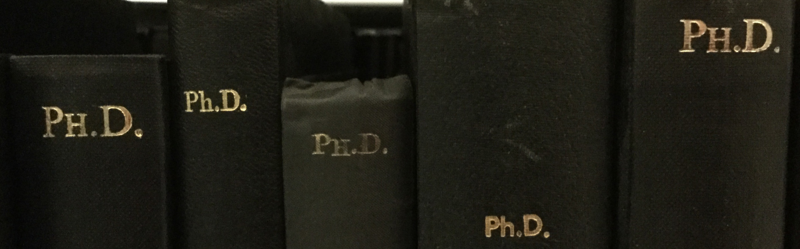
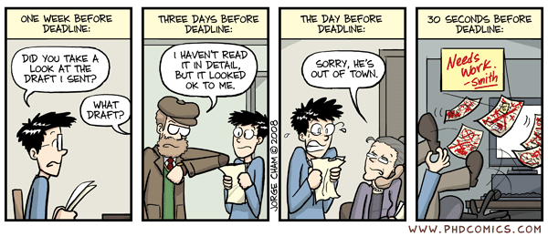
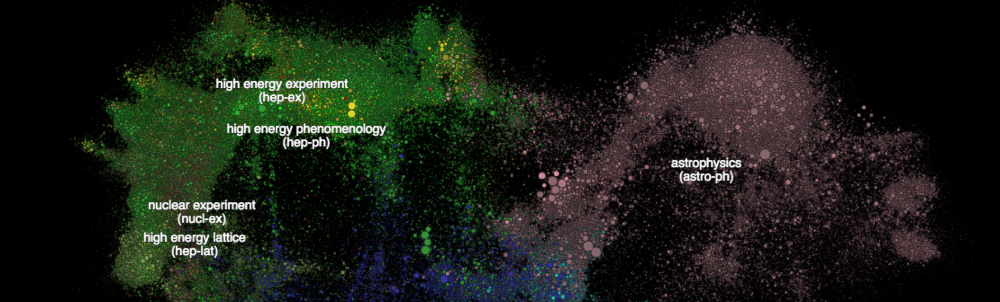
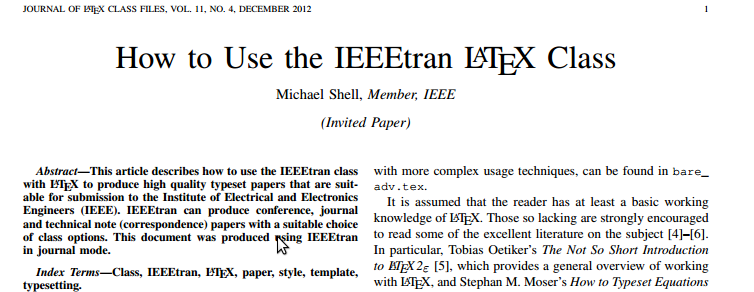
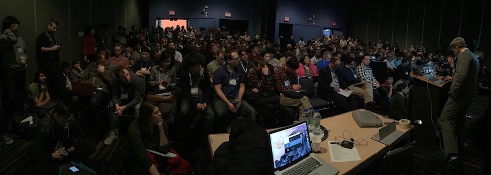
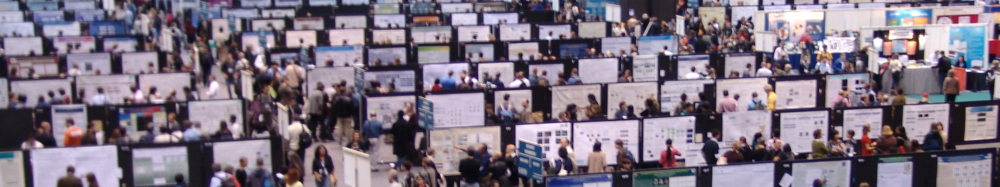

This guide is patterned after my [“Doing well in your courses”](http://cs.stanford.edu/people/karpathy/advice.html), a post I wrote a long time ago on some of the tips/tricks I’ve developed during my undergrad. I’ve received nice comments about that guide, so in the same spirit, now that my PhD has come to an end I wanted to compile a similar retrospective document in hopes that it might be helpful to some. Unlike the undergraduate guide, this one was much more difficult to write because there is significantly more variation in how one can traverse the PhD experience. Therefore, many things are likely contentious and a good fraction will be specific to what I’m familiar with (Computer Science / Machine Learning / Computer Vision research). But disclaimers are boring, lets get to it!  

本指南是根据我的“在课程中表现出色”编写的，这是我很久以前写的一篇关于我在本科期间开发的一些提示/技巧的文章。我收到了关于该指南的好评，因此本着同样的精神，现在我的博士学位已经结束，我想编写一份类似的回顾性文件，希望它对某些人有所帮助。与本科生指南不同，这本指南更难编写，因为人们如何穿越博士经历的变化要大得多。因此，很多事情可能都是有争议的，其中很大一部分是针对我熟悉的领域（计算机科学/机器学习/计算机视觉研究）。但免责声明很无聊，让我们开始吧！

### Preliminaries 预赛

First, should you want to get a PhD? I was in a fortunate position of knowing since young age that I really wanted a PhD. Unfortunately it wasn’t for any very well-thought-through considerations: First, I really liked school and learning things and I wanted to learn as much as possible, and second, I really wanted to be like [Gordon Freeman](https://en.wikipedia.org/wiki/Gordon_Freeman) from the game Half-Life (who has a PhD from MIT in theoretical physics). I loved that game. But what if you’re more sensible in making your life’s decisions? Should you want to do a PhD? There’s a very nice [Quora thread](https://www.quora.com/I-got-a-job-offer-from-Google-Facebook-Microsoft-and-I-also-got-accepted-into-the-PhD-in-Computer-Science-program-at-MIT-Stanford-Berkeley-What-factors-should-I-consider-while-making-a-choice-between-the-two) and in the summary of considerations that follows I’ll borrow/restate several from Justin/Ben/others there. I’ll assume that the second option you are considering is joining a medium-large company (which is likely most common). Ask yourself if you find the following properties appealing:  

首先，你想获得博士学位吗？我很幸运，从小就知道自己真的想要博士学位。不幸的是，这并不是出于任何深思熟虑的考虑：首先，我真的很喜欢学校和学习东西，我想尽可能多地学习，其次，我真的很想成为游戏《Half》中的戈登·弗里曼—— Life（拥有麻省理工学院理论物理学博士学位）。我喜欢那个游戏。但如果你在做出人生决定时更加明智呢？你应该想攻读博士学位吗？ Quora 上有一个非常好的帖子，在接下来的注意事项总结中，我将借用/重述 Justin/Ben/其他人那里的一些帖子。我假设您正在考虑的第二个选择是加入一家中型公司（这可能是最常见的）。问问自己是否发现以下属性有吸引力：

**Freedom.** A PhD will offer you a lot of freedom in the topics you wish to pursue and learn about. You’re in charge. Of course, you’ll have an adviser who will impose some constraints but in general you’ll have much more freedom than you might find elsewhere.  

自由。博士学位将为您在想要追求和学习的主题上提供很大的自由度。你负责。当然，你会有一位顾问，他会施加一些限制，但总的来说，你会比在其他地方拥有更多的自由。

**Ownership.** The research you produce will be yours as an individual. Your accomplishments will have your name attached to them. In contrast, it is much more common to “blend in” inside a larger company. A common feeling here is becoming a “cog in a wheel”.  

所有权。您所做的研究将属于您个人。你的成就将带有你的名字。相比之下，“融入”大公司内部则更为常见。这里的一个常见感觉是成为“轮子上的齿轮”。

**Exclusivity**. There are very few people who make it to the top PhD programs. You’d be joining a group of a few hundred distinguished individuals in contrast to a few tens of thousands (?) that will join some company.  

排他性。能进入顶尖博士项目的人很少。您将加入一个由数百名杰出人士组成的团体，而不是加入某家公司的数以万计（？）。

**Status.** Regardless of whether it should be or not, working towards and eventually getting a PhD degree is culturally revered and recognized as an impressive achievement. You also get to be a Doctor; that’s awesome.  

地位。不管是否应该，努力并最终获得博士学位在文化上受到尊重并被认为是一项令人印象深刻的成就。你还可以成为一名医生；棒极了。

**Personal freedom.** As a PhD student you’re your own boss. Want to sleep in today? Sure. Want to skip a day and go on a vacation? Sure. All that matters is your final output and no one will force you to clock in from 9am to 5pm. Of course, some advisers might be more or less flexible about it and some companies might be as well, but it’s a true first order statement.  

个人自由。作为一名博士生，你就是自己的老板。今天想睡懒觉吗？当然。想要跳过一天去度假吗？当然。重要的是你的最终输出，没有人会强迫你从上午 9 点到下午 5 点打卡。当然，一些顾问可能对此或多或少有灵活性，一些公司也可能如此，但这是真正的首要声明。

**Maximizing future choice.** Joining a PhD program doesn’t close any doors or eliminate future employment/lifestyle options. You can go one way (PhD -> anywhere else) but not the other (anywhere else -> PhD -> academia/research; it is statistically less likely). Additionally (although this might be quite specific to applied ML), you’re strictly more hirable as a PhD graduate or even as a PhD dropout and many companies might be willing to put you in a more interesting position or with a higher starting salary. More generally, maximizing choice for the future you is a good heuristic to follow.  

最大化未来的选择。加入博士课程并不关闭任何大门或消除未来的就业/生活方式选择。你可以选择一种方式（博士 -> 其他任何地方），但不能选择另一种方式（其他任何地方 -> 博士 -> 学术界/研究；统计上可能性较小）。此外（尽管这可能是针对应用机器学习的），严格来说，作为一名博士毕业生，甚至作为一名博士辍学者，你更容易被聘用，并且许多公司可能愿意为你提供更有趣的职位或更高的起薪。更一般地说，为你的未来提供最大化的选择是一个很好的启发。

**Maximizing variance.** You’re young and there’s really no need to rush. Once you graduate from a PhD you can spend the next ~50 years of your life in some company. Opt for more variance in your experiences.  

最大化方差。你还年轻，确实没必要着急。博士毕业后，您可以在某家公司度过接下来的 50 年左右的人生。选择更多差异的体验。

**Personal growth.** PhD is an intense experience of rapid growth (you learn a lot) and personal self-discovery (you’ll become a master of managing your own psychology). PhD programs (especially if you can make it into a good one) also offer a _high density_ of exceptionally bright people who will become your best friends forever.  

个人成长。博士学位是一次快速成长（你学到很多东西）和个人自我发现（你将成为管理自己心理的大师）的强烈经历。博士课程（特别是如果你能成为一名优秀的博士课程）还提供大量非常聪明的人，他们将成为你永远最好的朋友。

**Expertise.** PhD is probably your only opportunity in life to really drill deep into a topic and become a recognized leading expert _in the world_ at something. You’re exploring the edge of our knowledge as a species, without the burden of lesser distractions or constraints. There’s something beautiful about that and if you disagree, it could be a sign that PhD is not for you.  

专业知识。博士学位可能是您一生中唯一真正深入研究某个主题并成为某领域公认的领先专家的机会。你正在探索我们作为一个物种的知识边缘，而没有较少的干扰或限制的负担。这有一些美好的东西，如果你不同意，这可能表明博士学位不适合你。

**The disclaimer**. I wanted to also add a few words on some of the potential downsides and failure modes. The PhD is a very specific kind of experience that deserves a large disclaimer. You will inevitably find yourself working very hard (especially before paper deadlines). You need to be okay with the suffering and have enough mental stamina and determination to deal with the pressure. At some points you will lose track of what day of the week it is and go on a diet of leftover food from the microkitchens. You’ll sit exhausted and alone in the lab on a beautiful, sunny Saturday scrolling through Facebook pictures of your friends having fun on exotic trips, paid for by their 5-10x larger salaries. You will have to throw away 3 months of your work while somehow keeping your mental health intact. You’ll struggle with the realization that months of your work were spent on a paper with a few citations while your friends do exciting startups with TechCrunch articles or push products to millions of people. You’ll experience identity crises during which you’ll question your life decisions and wonder what you’re doing with some of the best years of your life. As a result, you should be quite certain that you can thrive in an unstructured environment in the pursuit research and discovery for science. If you’re unsure you should lean slightly negative by default. Ideally you should consider getting a taste of research as an undergraduate on a summer research program before before you decide to commit. In fact, one of the primary reasons that research experience is so desirable during the PhD hiring process is not the research itself, but the fact that the student is more likely to know what they’re getting themselves into.  

免责声明。我还想就一些潜在的缺点和故障模式添加几句话。博士学位是一种非常特殊的经历，值得大量免责声明。你将不可避免地发现自己工作非常努力（尤其是在论文截止日期之前）。你需要接受苦难，并有足够的精神耐力和决心来应对压力。有时你会忘记今天是一周中的哪一天，并继续吃小厨房里剩下的食物。在一个美丽、阳光明媚的周六，你会筋疲力尽地独自坐在实验室里，浏览朋友们在异国旅行中享受乐趣的 Facebook 照片，而这些照片的费用是他们高出 5-10 倍的薪水。你将不得不扔掉三个月的工作，同时以某种方式保持你的心理健康完好无损。你会很难意识到，你的几个月的工作都花在了一篇被引用很少的论文上，而你的朋友却在用 TechCrunch 的文章做令人兴奋的初创公司或向数百万人推销产品。你会经历身份危机，在此期间你会质疑你的人生决定，并想知道你在生命中最美好的时光里做了什么。因此，您应该非常确定自己可以在非结构化环境中茁壮成长，追求科学的研究和发现。如果你不确定，默认情况下你应该稍微倾向于负面。理想情况下，在决定投入之前，你应该考虑作为一名本科生参加暑期研究项目，体验一下研究的乐趣。事实上，在博士招聘过程中，研究经验如此受欢迎的主要原因之一不是研究本身，而是学生更有可能知道自己要做什么。

I should clarify explicitly that this post is not about convincing anyone to do a PhD, I’ve merely tried to enumerate some of the common considerations above. The majority of this post focuses on some tips/tricks for navigating the experience once if you decide to go for it (which we’ll see shortly, below).  

我应该明确澄清，这篇文章并不是要说服任何人攻读博士学位，我只是试图列举上面的一些常见考虑因素。这篇文章的大部分内容重点介绍了一些提示/技巧，供您决定尝试一次体验时使用（我们很快就会在下面看到）。

Lastly, as a random thought I heard it said that you should only do a PhD if you want to go into academia. In light of all of the above I’d argue that a PhD has strong intrinsic value - it’s an end by itself, not just a means to some end (e.g. academic job).  

最后，作为一个随机的想法，我听到有人说，如果你想进入学术界，你应该只攻读博士学位。鉴于上述所有内容，我认为博士学位具有很强的内在价值——它本身就是一个目的，而不仅仅是达到某种目的的手段（例如学术工作）。

**Getting into a PhD program: references, references, references.** Great, you’ve decided to go for it. Now how do you get into a good PhD program? The first order approximation is quite simple - by far most important component are strong reference letters. The ideal scenario is that a well-known professor writes you a letter along the lines of: “Blah is in top 5 of students I’ve ever worked with. She takes initiative, comes up with her own ideas, and gets them to work.” The worst letter is along the lines of: “Blah took my class. She did well.” A research publication under your belt from a summer research program is a very strong bonus, but not absolutely required provided you have strong letters. In particular note: grades are quite irrelevant but you generally don’t want them to be too low. This was not obvious to me as an undergrad and I spent a lot of energy on getting good grades. This time should have instead been directed towards research (or at the very least personal projects), as much and as early as possible, and if possible under supervision of multiple people (you’ll need 3+ letters!). As a last point, what won’t help you too much is pestering your potential advisers out of the blue. They are often incredibly busy people and if you try to approach them too aggressively in an effort to impress them somehow in conferences or over email this may agitate them.  

进入博士课程：参考资料，参考资料，参考资料。太好了，你已经决定这么做了。现在你如何进入一个好的博士项目？一阶近似非常简单——到目前为止，最重要的组成部分是强有力的推荐信。理想的情况是，一位知名教授给你写了一封信，内容如下：“Blah 在我共事过的学生中名列前五。她采取主动，提出自己的想法，并付诸实施。”最糟糕的信是这样的：“废话选了我的课。她做得很好。”暑期研究项目的研究出版物是一个非常大的奖励，但如果你有强有力的推荐信，那么这并不是绝对必需的。特别注意：成绩完全无关紧要，但你通常不希望它们太低。作为一名本科生，这对我来说并不明显，我花了很多精力来取得好成绩。这次应该尽可能多、尽早地用于研究（或者至少是个人项目），如果可能的话，在多人的监督下（你需要 3 个以上的字母！）。最后一点，突然纠缠你的潜在顾问对你没有太大帮助。他们通常是非常忙碌的人，如果你试图过于积极地接近他们，试图在会议或电子邮件中给他们留下深刻的印象，这可能会激怒他们。

**Picking the school**. Once you get into some PhD programs, how do you pick the school? It’s easy, join Stanford! Just kidding. More seriously, your dream school should 1) be a top school (not because it looks good on your resume/CV but because of feedback loops; top schools attract other top people, many of whom you will get to know and work with) 2) have a few potential advisers you would want to work with. I really do mean the “few” part - this is very important and provides a safety cushion for you if things don’t work out with your top choice for any one of hundreds of reasons - things in many cases outside of your control, e.g. your dream professor leaves, moves, or spontaneously disappears, and 3) be in a good environment physically. I don’t think new admits appreciate this enough: you will spend 5+ years of your really good years living near the school campus. Trust me, this is a long time and your life will consist of much more than just research.  

选学校。一旦你进入了一些博士项目，你会如何选择学校？很简单，加入斯坦福大学！只是在开玩笑。更严重的是，您梦想的学校应该 1) 是一所顶尖学校（不是因为它在您的简历/履历上看起来不错，而是因为反馈循环；顶尖学校吸引其他顶尖人才，其中许多人您将结识并与之共事）2 ）有一些您想与之合作的潜在顾问。我的意思确实是“少数”部分 - 这非常重要，并且如果由于数百个原因中的任何一个原因导致你的首选方案无法解决问题（在许多情况下，事情超出了你的控制范围），它可以为你提供安全缓冲。你梦想中的教授离开、搬家或自发消失，并且 3) 处于良好的身体环境中。我认为新录取的人还不够重视这一点：你将在校园附近度过 5 年以上真正美好的时光。相信我，这是一段很长的时间，你的生活将不仅仅包括研究。

### Adviser 顾问

**Student adviser relationship**. The adviser is an extremely important person who will exercise a lot of influence over your PhD experience. It’s important to understand the nature of the relationship: the adviser-student relationship is a symbiosis; you have your own goals and want something out of your PhD, but they also have their own goals, constraints and they’re building their own career. Therefore, it is very helpful to understand your adviser’s incentive structures: how the tenure process works, how they are evaluated, how they get funding, how they fund you, what department politics they might be embedded in, how they win awards, how academia in general works and specifically how they gain recognition and respect of their colleagues. This alone will help you avoid or mitigate a large fraction of student-adviser friction points and allow you to plan appropriately. I also don’t want to make the relationship sound too much like a business transaction. The advisor-student relationship, more often that not, ends up developing into a lasting one, predicated on much more than just career advancement.  

学生顾问关系。导师是一个非常重要的人，他会对你的博士经历产生很大的影响。了解这种关系的本质很重要：导师与学生的关系是一种共生关系；你有自己的目标，想从博士学位中得到一些东西，但他们也有自己的目标、限制，他们正在建立自己的职业生涯。因此，了解顾问的激励结构非常有帮助：任期流程如何运作，如何评估他们，他们如何获得资金，他们如何资助你，他们可能参与哪些部门政治，他们如何赢得奖项，学术界如何一般工作，特别是他们如何获得同事的认可和尊重。仅此一点就可以帮助您避免或减轻大部分学生与顾问的摩擦点，并让您能够做出适当的计划。我也不想让这种关系听起来太像商业交易。导师与学生的关系通常会发展成为持久的关系，而不仅仅是职业发展。

**Pre-vs-post tenure**. Every adviser is different so it’s helpful to understand the axes of variations and their repercussions on your PhD experience. As one rule of thumb (and keep in mind there are many exceptions), it’s important to keep track of whether a potential adviser is pre-tenure or post-tenure. The younger faculty members will usually be around more (they are working hard to get tenure) and will usually be more low-level, have stronger opinions on what you should be working on, they’ll do math with you, pitch concrete ideas, or even look at (or contribute to) your code. This is a much more hands-on and possibly intense experience because the adviser will need a strong publication record to get tenure and they are incentivised to push you to work just as hard. In contrast, more senior faculty members may have larger labs and tend to have many other commitments (e.g. committees, talks, travel) other than research, which means that they can only afford to stay on a higher level of abstraction both in the area of their research and in the level of supervision for their students. To caricature, it’s a difference between “you’re missing a second term in that equation” and “you may want to read up more in this area, talk to this or that person, and sell your work this or that way”. In the latter case, the low-level advice can still come from the senior PhD students in the lab or the postdocs.  

任期前与任期后。每个顾问都是不同的，因此了解变化的轴及其对您的博士经历的影响很有帮助。作为一条经验法则（请记住，有很多例外），跟踪潜在顾问是任期前还是任期后非常重要。年轻的教员通常会更多（他们正在努力获得终身教职）并且通常水平较低，对你应该从事的工作有更强烈的意见，他们会和你一起做数学，提出具体的想法，甚至查看（或贡献）您的代码。这是一种更加实践性强、也可能更加激烈的体验，因为顾问需要良好的发表记录才能获得终身职位，并且他们会激励你努力工作。相比之下，更高级的教职人员可能拥有更大的实验室，并且除了研究之外往往还有许多其他承诺（例如委员会、演讲、旅行），这意味着他们只能在以下领域保持较高的抽象水平：他们的研究和对学生的监督水平。讽刺地说，这是“你错过了这个等式中的第二项”和“你可能想在这个领域阅读更多内容，与这个或那个人交谈，并以这种或那种方式出售你的作品”之间的区别。在后一种情况下，低级建议仍然可以来自实验室的高年级博士生或博士后。

**Axes of variation**. There are many other axes to be aware of. Some advisers are fluffy and some prefer to keep your relationship very professional. Some will try to exercise a lot of influence on the details of your work and some are much more hands off. Some will have a focus on specific models and their applications to various tasks while some will focus on tasks and more indifference towards any particular modeling approach. In terms of more managerial properties, some will meet you every week (or day!) multiple times and some you won’t see for months. Some advisers answer emails right away and some don’t answer email for a week (or ever, haha). Some advisers make demands about your work schedule (e.g. you better work long hours or weekends) and some won’t. Some advisers generously support their students with equipment and some think laptops or old computers are mostly fine. Some advisers will fund you to go to a conferences even if you don’t have a paper there and some won’t. Some advisers are entrepreneurial or applied and some lean more towards theoretical work. Some will let you do summer internships and some will consider internships just a distraction.  

变化轴。还有许多其他轴需要注意。有些顾问很肤浅，有些则喜欢让你们的关系保持非常专业。有些人会尝试对你的工作细节施加很大的影响，而有些人则不干涉。有些人会专注于特定模型及其在各种任务中的应用，而有些人会专注于任务，而对任何特定的建模方法更加漠不关心。就更多管理资产而言，有些会每周（或每天！）多次与您见面，有些则几个月都见不到。有些顾问立即回复电子邮件，有些顾问一周（或永远，哈哈）不回复电子邮件。有些顾问对你的工作时间表提出要求（例如，你最好长时间工作或周末工作），有些则不会。一些顾问慷慨地为学生提供设备支持，而另一些顾问则认为笔记本电脑或旧电脑大多都可以。即使您没有论文，有些顾问也会资助您参加会议，而有些顾问则不会。有些顾问是创业型或应用型顾问，有些则更倾向于理论工作。有些会让你进行暑期实习，有些则认为实习只是一种干扰。

**Finding an adviser**. So how do you pick an adviser? The first stop, of course, is to talk to them in person. The student-adviser relationship is sometimes referred to as a marriage and you should make sure that there is a good fit. Of course, first you want to make sure that you can talk with them and that you get along personally, but it’s also important to get an idea of what area of “professor space” they occupy with respect to the aforementioned axes, and especially whether there is an intellectual resonance between the two of you in terms of the problems you are interested in. This can be just as important as their management style.  

寻找顾问。那么如何选择顾问呢？第一站当然是亲自与他们交谈。学生与顾问的关系有时被称为婚姻，您应该确保双方非常合适。当然，首先你要确保你可以与他们交谈并且个人相处融洽，但了解他们相对于上述轴占据的“教授空间”区域也很重要，尤其是是否你们两个在感兴趣的问题上存在智力上的共鸣。这与他们的管理风格一样重要。

**Collecting references**. You should also collect references on your potential adviser. One good strategy is to talk to their students. If you want to get actual information this shouldn’t be done in a very formal way or setting but in a relaxed environment or mood (e.g. a party). In many cases the students might still avoid saying bad things about the adviser if asked in a general manner, but they will usually answer truthfully when you ask specific questions, e.g. “how often do you meet?”, or “how hands on are they?”. Another strategy is to look at where their previous students ended up (you can usually find this on the website under an alumni section), which of course also statistically informs your own eventual outcome.  

收集参考资料。您还应该收集有关您潜在顾问的推荐信。一种好的策略是与学生交谈。如果您想获取实际信息，则不应以非常正式的方式或环境进行，而应在轻松的环境或心情（例如聚会）中进行。在许多情况下，如果以一般方式询问，学生可能仍然会避免说导师的坏话，但当你问具体问题时，他们通常会如实回答，例如： “你们多久见面一次？”，或者“他们的动手能力如何？”。另一个策略是看看他们以前的学生最终去了哪里（你通常可以在网站的校友部分找到这个），这当然也可以从统计上告诉你自己的最终结果。

**Impressing an adviser**. The adviser-student matching process is sometimes compared to a marriage - you pick them but they also pick you. The ideal student from their perspective is someone with interest and passion, someone who doesn’t need too much hand-holding, and someone who takes initiative - who shows up a week later having done not just what the adviser suggested, but who went beyond it; improved on it in unexpected ways.  

给顾问留下深刻印象。导师与学生的匹配过程有时被比作婚姻——你选择他们，他们也选择你。从他们的角度来看，理想的学生是一个有兴趣和热情的人，一个不需要太多指导的人，一个主动的人——一周后出现的人不仅做了导师建议的事情，而且超越了导师的建议。它;以意想不到的方式对其进行了改进。

**Consider the entire lab**. Another important point to realize is that you’ll be seeing your adviser maybe once a week but you’ll be seeing most of their students every single day in the lab and they will go on to become your closest friends. In most cases you will also end up collaborating with some of the senior PhD students or postdocs and they will play a role very similar to that of your adviser. The postdocs, in particular, are professors-in-training and they will likely be eager to work with you as they are trying to gain advising experience they can point to for their academic job search. Therefore, you want to make sure the entire group has people you can get along with, people you respect and who you can work with closely on research projects.  

考虑整个实验室。另一个需要意识到的重要点是，你可能每周会见你的导师一次，但你每天都会在实验室见到他们的大多数学生，他们将继续成为你最亲密的朋友。在大多数情况下，您最终还会与一些高年级博士生或博士后合作，他们将扮演与您的导师非常相似的角色。尤其是博士后，他们是受训教授，他们可能会渴望与您合作，因为他们正在努力获得可以为学术求职提供参考的经验。因此，你要确保整个团队都有你可以相处的人、你尊敬的人以及你可以在研究项目上密切合作的人。

### Research topics 研究课题

t-SNE visualization of a small subset of human knowledge (from [paperscape](http://paperscape.org/)). Each circle is an arxiv paper and size indicates the number of citations.  

一小部分人类知识的 t-SNE 可视化（来自 paperscape）。每个圆圈都是一篇 arxiv 论文，大小表示引用次数。

So you’ve entered a PhD program and found an adviser. Now what do you work on?  

所以你已经进入了博士学位课程并找到了一位顾问。现在你做什么工作？

**An exercise in the outer loop.** First note the nature of the experience. A PhD is simultaneously a fun and frustrating experience because you’re constantly operating on a meta problem level. You’re not just solving problems - that’s merely the simple inner loop. You spend most of your time on the outer loop, figuring out what problems are worth solving and what problems are ripe for solving. You’re constantly imagining yourself solving hypothetical problems and asking yourself where that puts you, what it could unlock, or if anyone cares. If you’re like me this can sometimes drive you a little crazy because you’re spending long hours working on things and you’re not even sure if they are the correct things to work on or if a solution exists.  

外循环的练习。首先注意体验的性质。攻读博士学位既有趣又令人沮丧，因为你不断地在元问题层面上进行操作。你不仅仅是在解决问题——这只是简单的内部循环。您将大部分时间花在外循环上，找出哪些问题值得解决以及哪些问题已经成熟可以解决。你不断地想象自己正在解决假设的问题，并问自己这会将你置于何处，它可以解锁什么，或者是否有人关心。如果你像我一样，这有时会让你有点疯狂，因为你花了很长时间在事情上，你甚至不确定它们是否是正确的事情，或者是否存在解决方案。

**Developing taste**. When it comes to choosing problems you’ll hear academics talk about a mystical sense of “taste”. It’s a real thing. When you pitch a potential problem to your adviser you’ll either see their face contort, their eyes rolling, and their attention drift, or you’ll sense the excitement in their eyes as they contemplate the uncharted territory ripe for exploration. In that split second a lot happens: an evaluation of the problem’s importance, difficulty, its _sexiness_, its historical context (and possibly also its fit to their active grants). In other words, your adviser is likely to be a master of the outer loop and will have a highly developed sense of _taste_ for problems. During your PhD you’ll get to acquire this sense yourself.  

培养品味。当谈到选择问题时，你会听到学者们谈论一种神秘的“品味”。这是真实的事情。当你向顾问提出一个潜在的问题时，你要么会看到他们的脸扭曲，他们的眼睛转动，他们的注意力转移，要么你会感觉到他们眼中的兴奋，因为他们正在考虑探索未知的领域。在那一瞬间发生了很多事情：评估问题的重要性、难度、其性感性、历史背景（也可能还有其与他们积极资助的契合度）。换句话说，你的顾问很可能是外环的大师，并且对问题有高度发达的品味。在攻读博士学位期间，您将自己获得这种感觉。

In particular, I think I had a terrible taste coming in to the PhD. I can see this from the notes I took in my early PhD years. A lot of the problems I was excited about at the time were in retrospect poorly conceived, intractable, or irrelevant. I’d like to think I refined the sense by the end through practice and apprenticeship.  

特别是，我认为我对博士学位的品味很糟糕。我可以从我博士早期的笔记中看到这一点。回想起来，当时令我兴奋的许多问题都是构思不佳、棘手或无关紧要的。我想我最终通过练习和学徒完善了这种感觉。

Let me now try to serialize a few thoughts on what goes into this sense of taste, and what makes a problem interesting to work on.  

现在让我尝试连载一些关于这种味觉的一些想法，以及是什么让一个问题变得有趣。

**A fertile ground.** First, recognize that during your PhD you will dive deeply into one area and your papers will very likely chain on top of each other to create a body of work (which becomes your thesis). Therefore, you should always be thinking several steps ahead when choosing a problem. It’s impossible to predict how things will unfold but you can often get a sense of how much room there could be for additional work.  

一片肥沃的土地。首先，要认识到，在攻读博士学位期间，您将深入研究一个领域，并且您的论文很可能会相互叠加以创建一系列工作（成为您的论文）。因此，在选择问题时，您应该始终提前考虑几个步骤。预测事情将如何发展是不可能的，但你通常可以感觉到还有多少空间可以进行额外的工作。

**Plays to your adviser’s interests and strengths**. You will want to operate in the realm of your adviser’s interest. Some advisers may allow you to work on slightly tangential areas but you would not be taking full advantage of their knowledge and you are making them less likely to want to help you with your project or promote your work. For instance, (and this goes to my previous point of understanding your adviser’s job) every adviser has a “default talk” slide deck on their research that they give all the time and if your work can add new exciting cutting edge work slides to this deck then you’ll find them much more invested, helpful and involved in your research. Additionally, their talks will promote and publicize your work.  

发挥顾问的兴趣和优势。您将希望在顾问感兴趣的范围内开展业务。一些顾问可能允许你在稍微不切题的领域工作，但你不会充分利用他们的知识，而且你会让他们不太愿意帮助你完成你的项目或推广你的工作。例如，（这就是我之前理解顾问工作的观点）每个顾问都有一个关于他们的研究的“默认谈话”幻灯片，他们一直在提供这些幻灯片，如果您的工作可以在此添加新的令人兴奋的前沿工作幻灯片然后你会发现他们更加投入、乐于助人并参与你的研究。此外，他们的演讲将促进和宣传您的工作。

**Be ambitious: the sublinear scaling of hardness.** People have a strange bug built into psychology: a 10x more important or impactful problem intuitively _feels_ 10x harder (or 10x less likely) to achieve. This is a fallacy - in my experience a 10x more important problem is at most 2-3x harder to achieve. In fact, in some cases a 10x harder problem may be easier to achieve. How is this? It’s because thinking 10x forces you out of the box, to confront the real limitations of an approach, to think from first principles, to change the strategy completely, to innovate. If you aspire to improve something by 10% and work hard then you will. But if you aspire to improve it by 100% you are still quite likely to, but you will do it very differently.  

雄心勃勃：硬度的亚线性缩放。人们的心理学中存在一个奇怪的缺陷：一个更重要或更有影响力的问题 10 倍，直观上感觉要实现 10 倍困难（或可能性低 10 倍）。这是一个谬论——根据我的经验，重要 10 倍的问题最多也难实现 2-3 倍。事实上，在某些情况下，10 倍难的问题可能更容易解决。这怎么样？这是因为 10 倍思考迫使你跳出框框，面对方法的真正局限性，从首要原则出发思考，彻底改变策略，进行创新。如果你渴望在某件事上提高 10% 并努力工作，那么你就能实现。但如果你渴望将其提高 100%，你仍然很有可能做到，但你会采取非常不同的方式。

**Ambitious but with an attack.** At this point it’s also important to point out that there are plenty of important problems that don’t make great projects. I recommend reading [You and Your Research](http://karpathy.github.io/2016/09/07/phd/You%20and%20Your%20Research) by Richard Hamming, where this point is expanded on:  

雄心勃勃，但有攻击性。在这一点上，还需要指出的是，有很多重要的问题并不能成为伟大的项目。我建议阅读理查德·汉明的《你和你的研究》，其中对这一点进行了扩展：

> If you do not work on an important problem, it’s unlikely you’ll do important work. It’s perfectly obvious. Great scientists have thought through, in a careful way, a number of important problems in their field, and they keep an eye on wondering how to attack them. Let me warn you, \`important problem’ must be phrased carefully. The three outstanding problems in physics, in a certain sense, were never worked on while I was at Bell Labs. By important I mean guaranteed a Nobel Prize and any sum of money you want to mention. We didn’t work on (1) time travel, (2) teleportation, and (3) antigravity. They are not important problems because we do not have an attack. It’s not the consequence that makes a problem important, it is that you have a reasonable attack. That is what makes a problem important.  
> 
> 如果你不解决一个重要的问题，你就不可能做重要的工作。这是非常明显的。伟大的科学家以仔细的方式思考了他们领域中的许多重要问题，并密切关注如何解决这些问题。让我警告你，“重要问题”必须小心措辞。从某种意义上说，我在贝尔实验室期间从未解决过这三个突出的物理问题。我所说的“重要”是指保证获得诺贝尔奖以及您想要提及的任何金额。我们没有研究（1）时间旅行、（2）隐形传输和（3）反重力。它们不是重要的问题，因为我们没有受到攻击。问题的重要性不在于结果，而在于你有合理的攻击。这就是问题变得重要的原因。

**The person who did X**. Ultimately, the goal of a PhD is to not only develop a deep expertise in a field but to also make your mark upon it. To steer it, shape it. The ideal scenario is that by the end of the PhD you own some part of an important area, preferably one that is also easy and fast to describe. You want people to say things like “she’s the person who did X”. If you can fill in a blank there you’ll be successful.  

最终，博士学位的目标不仅是在某个领域发展深厚的专业知识，而且还要在该领域留下自己的印记。要引导它，塑造它。理想的情况是，在博士学位结束时，您拥有一个重要领域的某些部分，最好是能够轻松快速地描述的部分。你希望人们说“她是做了某事的人”之类的话。如果你能填补那里的空白，你就会成功。

**Valuable skills.** Recognize that during your PhD you will become an expert at the area of your choosing (as fun aside, note that \[5 years\]x\[260 working days\]x\[8 hours per day\] is 10,400 hours; if you believe Gladwell then a PhD is exactly the amount of time to become an expert). So imagine yourself 5 years later being a world expert in this area (the 10,000 hours will ensure that regardless of the academic impact of your work). Are these skills exciting or potentially valuable to your future endeavors?  

宝贵的技能。认识到在攻读博士学位期间，您将成为您选择的领域的专家（除了有趣之外，请注意，\[5 年\]x\[260 个工作日\]x\[每天 8 小时\] 是 10,400 小时；如果您相信 Gladwell，那么博士学位正是成为专家的时间）。因此，想象一下您 5 年后成为该领域的世界专家（无论您的工作的学术影响如何，10,000 个小时将确保这一点）。这些技能对您未来的努力是否令人兴奋或具有潜在价值？

**Negative examples.** There are also some problems or types of papers that you ideally want to avoid. For instance, you’ll sometimes hear academics talk about _“incremental work”_ (this is the worst adjective possible in academia). Incremental work is a paper that enhances something existing by making it more complex and gets 2% extra on some benchmark. The amusing thing about these papers is that they have a reasonably high chance of getting accepted (a reviewer can’t point to anything to kill them; they are also sometimes referred to as “_cockroach papers_”), so if you have a string of these papers accepted you can feel as though you’re being very productive, but in fact these papers won’t go on to be highly cited and you won’t go on to have a lot of impact on the field. Similarly, finding projects should ideally not include thoughts along the lines of “there’s this next logical step in the air that no one has done yet, let me do it”, or “this should be an easy poster”.  

反面例子。还有一些问题或论文类型是您最好避免的。例如，你有时会听到学者谈论“增量工作”（这是学术界最糟糕的形容词）。增量工作是一篇论文，通过使其变得更加复杂来增强现有的东西，并在某些基准上获得 2% 的额外收益。这些论文的有趣之处在于，它们被接受的机会相当高（审稿人无法指出任何东西来杀死它们；它们有时也被称为“蟑螂论文”），所以如果你有一串这些论文被接受后，你可能会觉得自己很有成效，但事实上，这些论文不会继续被高度引用，你也不会继续对该领域产生很大的影响。同样，理想情况下，寻找项目不应包含“下一步逻辑步骤尚未完成，让我来做”或“这应该是一张简单的海报”之类的想法。

**Case study: my thesis**. To make some of this discussion more concrete I wanted to use the example of how my own PhD unfolded. First, fun fact: my entire thesis is based on work I did in the last 1.5 years of my PhD. i.e. it took me quite a long time to wiggle around in the metaproblem space and find a problem that I felt very excited to work on (the other ~2 years I mostly meandered on 3D things (e.g. Kinect Fusion, 3D meshes, point cloud features) and video things). Then at one point in my 3rd year I randomly stopped by Richard Socher’s office on some Saturday at 2am. We had a chat about interesting problems and I realized that some of his work on images and language was in fact getting at something very interesting (of course, the area at the intersection of images and language goes back quite a lot further than Richard as well). I couldn’t quite see all the papers that would follow but it seemed heuristically very promising: it was highly fertile (a lot of unsolved problems, a lot of interesting possibilities on grounding descriptions to images), I felt that it was very cool and important, it was easy to explain, it seemed to be at the boundary of possible (Deep Learning has just started to work), the datasets had just started to become available (Flickr8K had just come out), it fit nicely into Fei-Fei’s interests and even if I were not successful I’d at least get lots of practice with optimizing interesting deep nets that I could reapply elsewhere. I had a strong feeling of a tsunami of checkmarks as everything clicked in place in my mind. I pitched this to Fei-Fei (my adviser) as an area to dive into the next day and, with relief, she enthusiastically approved, encouraged me, and would later go on to steer me within the space (e.g. Fei-Fei insisted that I do image to sentence generation while I was mostly content with ranking.). I’m happy with how things evolved from there. In short, I meandered around for 2 years stuck around the outer loop, finding something to dive into. Once it clicked for me what that was based on several heuristics, I dug in.  

案例研究：我的论文。为了使这个讨论更加具体，我想用我自己的博士学位如何展开的例子。首先，有趣的是：我的整个论文都是基于我在博士最后 1.5 年所做的工作。也就是说，我花了很长时间在元问题空间中徘徊并找到了一个让我感到非常兴奋的问题（另外大约 2 年我主要在 3D 事物上徘徊（例如 Kinect Fusion、3D 网格、点云特征） ）和视频）。然后，在我第三年的某个时刻，我在某个周六凌晨 2 点随机拜访了理查德·索彻 (Richard Socher) 的办公室。我们聊了一些有趣的问题，我意识到他在图像和语言方面的一些工作实际上得到了一些非常有趣的东西（当然，图像和语言交叉点的领域比理查德还要早得多） ）。我不太能看到接下来的所有论文，但它似乎启发式地非常有前途：它非常丰富（很多未解决的问题，很多基于图像描述的有趣可能性），我觉得它非常酷并且重要的是，它很容易解释，它似乎处于可能的边界（深度学习刚刚开始工作），数据集刚刚开始可用（Flickr8K 刚刚出来），它非常适合飞飞的即使我没有成功，我至少也会得到很多优化有趣的深度网络的练习，我可以在其他地方重新应用这些练习。当一切都在我脑海中敲响时，我有一种强烈的勾选标记海啸般的感觉。我向飞飞（我的顾问）介绍了这个，作为第二天要深入研究的领域，她热情地批准、鼓励我，松了口气，随后继续引导我进入这个领域（例如， 飞飞坚持让我进行图像到句子的生成，而我主要满足于排名。）。我对事情的发展感到满意。简而言之，我在外环徘徊了两年，寻找可以深入研究的东西。一旦我根据几种启发法明白了这一点，我就开始深入研究。

**Resistance**. I’d like to also mention that your adviser is by no means infallible. I’ve witnessed and heard of many instances in which, in retrospect, the adviser made the wrong call. If you feel this way during your phd you should have the courage to sometimes ignore your adviser. Academia generally celebrates independent thinking but the response of your specific adviser can vary depending on circumstances. I’m aware of multiple cases where the bet worked out very well and I’ve also personally experienced cases where it did not. For instance, I disagreed strongly with some advice Andrew Ng gave me in my very first year. I ended up working on a problem he wasn’t very excited about and, surprise, he turned out to be very right and I wasted a few months. Win some lose some :)  

反抗。我还想提一下，你的顾问绝不是绝对正确的。我亲眼目睹并听说过很多事例，回想起来，顾问做出了错误的决定。如果你在读博士期间有这种感觉，你应该有勇气有时忽略你的导师。学术界通常推崇独立思考，但具体顾问的反应可能会根据具体情况而有所不同。我知道有很多次投注效果很好的案例，但我个人也经历过效果不佳的案例。例如，我强烈不同意吴恩达在第一年给我的一些建议。我最终解决了一个他不太感兴趣的问题，令人惊讶的是，结果证明他是非常正确的，我浪费了几个月的时间。赢了一些，输了一些:)

**Don’t play the game.** Finally, I’d like to challenge you to think of a PhD as more than just a sequence of papers. You’re not a paper writer. You’re a member of a research community and your goal is to push the field forward. Papers are one common way of doing that but I would encourage you to look beyond the established academic game. Think for yourself and from first principles. Do things others don’t do but should. Step off the treadmill that has been put before you. I tried to do some of this myself throughout my PhD. This blog is an example - it allows me communicate things that wouldn’t ordinarily go into papers. The ImageNet human reference experiments are an example - I felt strongly that it was important for the field to know the ballpark human accuracy on ILSVRC so I took a few weeks off and evaluated it. The academic search tools (e.g. arxiv-sanity) are an example - I felt continuously frustrated by the inefficiency of finding papers in the literature and I released and maintain the site in hopes that it can be useful to others. Teaching CS231n twice is an example - I put much more effort into it than is rationally advisable for a PhD student who should be doing research, but I felt that the field was held back if people couldn’t efficiently learn about the topic and enter. A lot of my PhD endeavors have likely come at a cost in standard academic metrics (e.g. h-index, or number of publications in top venues) but I did them anyway, I would do it the same way again, and here I am encouraging others to as well. To add a pitch of salt and wash down the ideology a bit, based on several past discussions with my friends and colleagues I know that this view is contentious and that many would disagree.  

不要玩游戏。最后，我想挑战你，将博士学位不仅仅是一系列论文。你不是论文作家。您是研究社区的成员，您的目标是推动该领域向前发展。论文是一种常见的方式，但我鼓励你超越既定的学术游戏。从首要原则出发，为自己思考。做别人不做但应该做的事情。走下摆在你面前的跑步机。在攻读博士学位期间，我尝试自己做一些这样的事情。这个博客就是一个例子——它让我能够交流通常不会出现在论文中的内容。 ImageNet 人类参考实验就是一个例子 - 我强烈地感觉到，对于该领域来说，了解 ILSVRC 上的大致人类准确性非常重要，因此我休息了几周并对其进行了评估。学术搜索工具（例如 arxiv-sanity）就是一个例子 - 在文献中查找论文的效率低下，我一直感到沮丧，我发布并维护了该网站，希望它对其他人有用。教授 CS231n 两次就是一个例子 - 我投入的精力比合理建议的博士生应该进行研究的努力要多得多，但我觉得如果人们无法有效地了解该主题并进入该领域，该领域就会受到阻碍。我的许多博士努力可能是以标准学术指标（例如 h 指数，或顶级场所的出版物数量）为代价的，但无论如何我还是做了它们，我会再次以同样的方式做，在这里我鼓励其他人也一样。添加一点盐并稍微洗刷一下意识形态，根据过去与我的朋友和同事的几次讨论，我知道这种观点是有争议的，很多人会不同意。

### Writing papers 写论文

Writing good papers is an essential survival skill of an academic (kind of like making fire for a caveman). In particular, it is very important to realize that papers are a specific thing: they look a certain way, they flow a certain way, they have a certain structure, language, and statistics that the other academics expect. It’s usually a painful exercise for me to look through some of my early PhD paper drafts because they are quite terrible. There is a lot to learn here.  

写好论文是学者的一项基本生存技能（有点像为穴居人生火）。特别是，认识到论文是一个特定的东西是非常重要的：它们看起来以某种方式，以某种方式流动，它们具有其他学者所期望的某种结构、语言和统计数据。对我来说，浏览一些早期的博士论文草稿通常是一件痛苦的事情，因为它们非常糟糕。这里有很多东西需要学习。

**Review papers.** If you’re trying to learn to write better papers it can feel like a sensible strategy to look at many good papers and try to distill patterns. This turns out to not be the best strategy; it’s analogous to only receiving positive examples for a binary classification problem. What you really want is to also have exposure to a large number of bad papers and one way to get this is by reviewing papers. Most good conferences have an acceptance rate of about 25% so most papers you’ll review are bad, which will allow you to build a powerful binary classifier. You’ll read through a bad paper and realize how unclear it is, or how it doesn’t define it’s variables, how vague and abstract its intro is, or how it dives in to the details too quickly, and you’ll learn to avoid the same pitfalls in your own papers. Another related valuable experience is to attend (or form) journal clubs - you’ll see experienced researchers critique papers and get an impression for how your own papers will be analyzed by others.  

审阅论文。如果你想学习写更好的论文，那么查看许多优秀论文并尝试提炼模式似乎是一个明智的策略。事实证明这不是最好的策略；这类似于仅接收二元分类问题的正例。你真正想要的是接触大量糟糕的论文，而实现这一点的一种方法是审阅论文。大多数好的会议的接受率约为 25%，因此您将审阅的大多数论文都很糟糕，这将使您能够构建强大的二元分类器。你会通读一篇糟糕的论文，并意识到它是多么不清楚，或者它如何没有定义它的变量，它的介绍是多么模糊和抽象，或者它是如何过快地深入细节，你将学会在你自己的论文中避免同样的陷阱。另一个相关的宝贵经验是参加（或组建）期刊俱乐部 - 你会看到经验丰富的研究人员评论论文，并了解其他人如何分析你自己的论文。

**Get the gestalt right.** I remember being impressed with Fei-Fei (my adviser) once during a reviewing session. I had a stack of 4 papers I had reviewed over the last several hours and she picked them up, flipped through each one for 10 seconds, and said one of them was good and the other three bad. Indeed, I was accepting the one and rejecting the other three, but something that took me several hours took her seconds. Fei-Fei was relying on the _gestalt_ of the papers as a powerful heuristic. Your papers, as you become a more senior researcher take on a characteristic look. An introduction of ~1 page. A ~1 page related work section with a good density of citations - not too sparse but not too crowded. A well-designed pull figure (on page 1 or 2) and system figure (on page 3) that were not made in MS Paint. A technical section with some math symbols somewhere, results tables with lots of numbers and some of them bold, one additional cute analysis experiment, and the paper has exactly 8 pages (the page limit) and not a single line less. You’ll have to learn how to endow your papers with the same gestalt because many researchers rely on it as a cognitive shortcut when they judge your work.  

获得正确的格式塔。我记得有一次在审稿会议上，我对飞飞（我的导师）印象深刻。我有一叠过去几个小时审阅过的四篇论文，她把它们捡起来，每一篇都翻了 10 秒钟，然后说其中一篇好，另外三篇不好。确实，我接受了其中一个，拒绝了另外三个，但我花了几个小时的事情却花了她几秒钟。飞飞依靠论文的格式塔作为一种强有力的启发。当你成为一名更高级的研究人员时，你的论文就会呈现出独特的外观。约 1 页的介绍。大约 1 页的相关工作部分具有良好的引用密度 - 不太稀疏但也不太拥挤。精心设计的拉图（第 1 或第 2 页）和系统图（第 3 页）不是用 MS Paint 制作的。技术部分有一些数学符号，结果表有很多数字，其中一些数字是粗体的，还有一个额外的可爱的分析实验，论文正好有 8 页（页数限制），一行也没有少。你必须学习如何赋予你的论文同样的格式塔，因为许多研究人员在评判你的工作时依赖它作为认知捷径。

**Identify the core contribution**. Before you start writing anything it’s important to identify the single core contribution that your paper makes to the field. I would especially highlight the word _single_. A paper is not a random collection of some experiments you ran that you report on. The paper sells a single thing that was not obvious or present before. You have to argue that the thing is important, that it hasn’t been done before, and then you support its merit experimentally in controlled experiments. The entire paper is organized around this core contribution with surgical precision. In particular it doesn’t have any additional fluff and it doesn’t try to pack anything else on a side. As a concrete example, I made a mistake in one of my earlier papers on [video classification](https://cs.stanford.edu/people/karpathy/deepvideo/deepvideo_cvpr2014.pdf) where I tried to pack in two contributions: 1) a set of architectural layouts for video convnets and an unrelated 2) multi-resolution architecture which gave small improvements. I added it because I reasoned first that maybe someone could find it interesting and follow up on it later and second because I thought that contributions in a paper are additive: two contributions are better than one. Unfortunately, this is false and very wrong. The second contribution was minor/dubious and it diluted the paper, it was distracting, and no one cared. I’ve made a similar mistake again in my [CVPR 2014 paper](https://cs.stanford.edu/people/karpathy/deepimagesent/) which presented two separate models: a ranking model and a generation model. Several good in-retrospect arguments could be made that I should have submitted two separate papers; the reason it was one is more historical than rational.  

确定核心贡献。在开始撰写任何内容之前，确定您的论文对该领域做出的单一核心贡献非常重要。我要特别强调“单身”这个词。论文并不是你所报告的一些实验的随机集合。报纸出售的是一种以前不明显或不存在的东西。你必须证明这件事很重要，以前从未做过，然后你在受控实验中通过实验来支持它的优点。整篇论文都是围绕这一核心贡献以外科手术般的精确度组织起来的。特别是它没有任何额外的绒毛，也不会试图在侧面包装任何其他东西。举一个具体的例子，我在一篇关于视频分类的早期论文中犯了一个错误，我试图将两个贡献打包在一起：1）一组视频卷积网络的架构布局和一个不相关的2）多分辨率架构，它提供了一些小的改进。我添加它是因为我首先推理也许有人会发现它有趣并稍后跟进它，其次是因为我认为论文中的贡献是累加的：两个贡献比一个更好。不幸的是，这是错误的，而且是非常错误的。第二个贡献是次要/可疑的，它稀释了论文，分散了注意力，没有人关心。我在 CVPR 2014 论文中再次犯了类似的错误，该论文提出了两个独立的模型：排名模型和生成模型。回顾起来，我可以提出一些很好的论据，认为我应该提交两篇单独的论文；其原因更多的是历史性而非理性性。

**The structure.** Once you’ve identified your core contribution there is a default recipe for writing a paper about it. The upper level structure is by default Intro, Related Work, Model, Experiments, Conclusions. When I write my intro I find that it helps to put down a coherent top-level narrative in latex comments and then fill in the text below. I like to organize each of my paragraphs around a single concrete point stated on the first sentence that is then supported in the rest of the paragraph. This structure makes it easy for a reader to skim the paper. A good flow of ideas is then along the lines of 1) X (+define X if not obvious) is an important problem 2) The core challenges are this and that. 2) Previous work on X has addressed these with Y, but the problems with this are Z. 3) In this work we do W (?). 4) This has the following appealing properties and our experiments show this and that. You can play with this structure a bit but these core points should be clearly made. Note again that the paper is surgically organized around your exact contribution. For example, when you list the challenges you want to list exactly the things that you address later; you don’t go meandering about unrelated things to what you have done (you can speculate a bit more later in conclusion). It is important to keep a sensible structure throughout your paper, not just in the intro. For example, when you explain the model each section should: 1) explain clearly what is being done in the section, 2) explain what the core challenges are 3) explain what a baseline approach is or what others have done before 4) motivate and explain what you do 5) describe it.  

结构。一旦你确定了自己的核心贡献，就会有一个默认的方法来撰写有关它的论文。上层结构默认为介绍、相关工作、模型、实验、结论。当我写介绍时，我发现在乳胶注释中写下连贯的顶级叙述然后填写下面的文本会有所帮助。我喜欢围绕第一句话中陈述的一个具体观点来组织我的每个段落，然后在该段落的其余部分中支持该具体观点。这种结构使读者可以轻松浏览论文。良好的思想流程遵循以下原则：1）X（+定义 X，如果不明显）是一个重要问题 2）核心挑战是这个那个。 2) 之前关于 X 的工作已经用 Y 解决了这些问题，但问题是 Z。 3) 在这项工作中我们做 W（？）。 4）它具有以下吸引人的特性，我们的实验证明了这一点和那个。您可以稍微尝试一下这个结构，但这些核心点应该明确说明。再次注意，这篇论文是围绕您的具体贡献精心组织的。例如，当您列出挑战时，您希望准确列出您稍后要解决的问题；你不会胡思乱想与你所做的事情无关的事情（你可以稍后再推测）。重要的是在整个论文中保持合理的结构，而不仅仅是在引言中。例如，当您解释模型时，每个部分应该： 1) 清楚地解释该部分正在做什么，2) 解释核心挑战是什么 3) 解释什么是基线方法或其他人之前做过什么 4) 激励和解释你做了什么 5) 描述它。

**Break the structure.** You should also feel free (and you’re encouraged to!) play with these formulas to some extent and add some spice to your papers. For example, see this amusing paper from [Razavian et al. in 2014](https://arxiv.org/abs/1403.6382) that structures the introduction as a dialog between a student and the professor. It’s clever and I like it. As another example, a lot of papers from [Alyosha Efros](https://people.eecs.berkeley.edu/~efros/) have a playful tone and make great case studies in writing fun papers. As only one of many examples, see this paper he wrote with Antonio Torralba: [Unbiased look at dataset bias](https://people.csail.mit.edu/torralba/publications/datasets_cvpr11.pdf). Another possibility I’ve seen work well is to include an FAQ section, possibly in the appendix.  

打破结构。您还应该随意（我们鼓励您这样做！）在某种程度上使用这些公式，并为您的论文添加一些趣味。例如，请参阅 Razavian 等人的这篇有趣的论文。 2014 年，将介绍构建为学生和教授之间的对话。它很聪明，我喜欢它。另一个例子是，Alyosha Efros 的许多论文都带有俏皮的语气，并且在撰写有趣的论文方面提供了很好的案例研究。这只是众多例子之一，请参阅他与 Antonio Torralba 合作撰写的这篇论文：公正地看待数据集偏差。我发现效果很好的另一种可能性是包含常见问题解答部分，可能在附录中。

**Common mistake: the laundry list.** One very common mistake to avoid is the “laundry list”, which looks as follows: “Here is the problem. Okay now to solve this problem first we do X, then we do Y, then we do Z, and now we do W, and here is what we get”. You should try very hard to avoid this structure. Each point should be justified, motivated, explained. Why do you do X or Y? What are the alternatives? What have others done? It’s okay to say things like this is common (add citation if possible). Your paper is not a report, an enumeration of what you’ve done, or some kind of a translation of your chronological notes and experiments into latex. It is a highly processed and very focused discussion of a problem, your approach and its context. It is supposed to teach your colleagues something and you have to justify your steps, not just describe what you did.  

常见错误：洗衣清单。要避免的一个非常常见的错误是“洗衣清单”，它看起来如下：“这就是问题所在。好吧，现在为了解决这个问题，我们首先做 X，然后做 Y，然后做 Z，现在我们做 W，这就是我们得到的结果”。您应该尽力避免这种结构。每个观点都应该有理由、有动机、有解释。为什么要做 X 或 Y？有哪些替代方案？其他人做了什么？可以说这样的事情很常见（如果可能的话添加引用）。你的论文不是一份报告，不是对你所做工作的列举，也不是你按时间顺序排列的笔记和实验到乳胶的某种翻译。这是对问题、你的方法及其背景的高度加工和非常集中的讨论。它应该教会你的同事一些东西，你必须证明你的步骤是正确的，而不仅仅是描述你做了什么。

**The language.** Over time you’ll develop a vocabulary of good words and bad words to use when writing papers. Speaking about machine learning or computer vision papers specifically as concrete examples, in your papers you never “study” or “investigate” (there are boring, passive, bad words); instead you “develop” or even better you “propose”. And you don’t present a “system” or, _shudder_, a “pipeline”; instead, you develop a “model”. You don’t learn “features”, you learn “representations”. And god forbid, you never “combine”, “modify” or “expand”. These are incremental, gross terms that will certainly get your paper rejected :).  

语言。随着时间的推移，你将掌握一些好词和坏词的词汇，以便在撰写论文时使用。具体来说，以机器学习或计算机视觉论文为例，在你的论文中你从不“学习”或“调查”（有无聊、被动、坏话）；相反，你“发展”，甚至更好，你“建议”。而且你并没有提出一个“系统”，或者令人不寒而栗的“管道”；而是一个“系统”。相反，你开发一个“模型”。你学的不是“特征”，而是“表征”。但愿上帝保佑，你永远不会“组合”、“修改”或“扩展”。这些是增量的、粗略的术语，肯定会让你的论文被拒绝:)。

**An internal deadlines 2 weeks prior**. Not many labs do this, but luckily Fei-Fei is quite adamant about an internal deadline 2 weeks before the due date in which you must submit at least a 5-page draft with all the final experiments (even if not with final numbers) that goes through an internal review process identical to the external one (with the same review forms filled out, etc). I found this practice to be extremely useful because forcing yourself to lay out the full paper almost always reveals some number of critical experiments you must run for the paper to flow and for its argument flow to be coherent, consistent and convincing.  

两周前的内部截止日期。没有多少实验室这样做，但幸运的是，飞飞非常坚持内部截止日期，即截止日期前两周，您必须提交至少 5 页的草稿，其中包含所有最终实验（即使没有最终数字）经过与外部相同的内部审查流程（填写相同的审查表格等）。我发现这种做法非常有用，因为强迫自己写出完整的论文几乎总是会揭示出一些必须进行的关键实验，才能使论文流畅，并使其论证流程连贯、一致和令人信服。

Another great resource on this topic is [Tips for Writing Technical Papers](https://cs.stanford.edu/people/widom/paper-writing.html) from Jennifer Widom.  

关于这个主题的另一个很棒的资源是 Jennifer Widom 的《撰写技术论文的技巧》。

### Writing code 编写代码

A lot of your time will of course be taken up with the _execution_ of your ideas, which likely involves a lot of coding. I won’t dwell on this too much because it’s not uniquely academic, but I would like to bring up a few points.  

当然，您的大量时间会花在执行您的想法上，这可能涉及大量编码。我不会过多讨论这个问题，因为这不是唯一的学术问题，但我想提出几点。

**Release your code**. It’s a somewhat surprising fact but you can get away with publishing papers and not releasing your code. You will also feel a lot of incentive to not release your code: it can be a lot of work (research code can look like spaghetti since you iterate very quickly, you have to clean up a lot), it can be intimidating to think that others might judge you on your at most decent coding abilities, it is painful to maintain code and answer questions from other people about it (forever), and you might also be concerned that people could spot bugs that invalidate your results. However, it is precisely for some of these reasons that you should commit to releasing your code: it will force you to adopt better coding habits due to fear of public shaming (which will end up saving you time!), it will force you to learn better engineering practices, it will force you to be more thorough with your code (e.g. writing unit tests to make bugs much less likely), it will make others much more likely to follow up on your work (and hence lead to more citations of your papers) and of course it will be much more useful to everyone as a record of exactly what was done for posterity. When you do release your code I recommend taking advantage of [docker containers](https://www.docker.com/); this will reduce the amount of headaches people email you about when they can’t get all the dependencies (and their precise versions) installed.  

发布你的代码。这是一个有点令人惊讶的事实，但你可以发表论文而不发布你的代码。您还会感受到很多不发布代码的动机：这可能需要大量工作（研究代码可能看起来像意大利面条，因为您迭代得非常快，您必须进行大量清理），想到这一点可能会令人生畏其他人可能会根据你最不错的编码能力来评判你，维护代码并回答其他人关于它的问题（永远）是痛苦的，你可能还担心人们可能会发现使你的结果无效的错误。然而，正是由于其中一些原因，您应该承诺发布您的代码：由于担心公开羞辱，它将迫使您采取更好的编码习惯（这最终会节省您的时间！），它将迫使您学习更好的工程实践，它将迫使您更彻底地编写代码（例如，编写单元测试以减少出现错误的可能性），这将使其他人更有可能跟进您的工作（从而导致更多的引用你的论文），当然，作为为后代所做的事情的记录，它对每个人来说都会更有用。当您发布代码时，我建议您利用 docker 容器；这将减少人们在无法安装所有依赖项（及其精确版本）时向您发送电子邮件的麻烦。

**Think of the future you**. Make sure to document all your code very well for yourself. I guarantee you that you will come back to your code base a few months later (e.g. to do a few more experiments for the camera ready version of the paper), and you will feel _completely_ lost in it. I got into the habit of creating very thorough readme.txt files in all my repos (for my personal use) as notes to future self on how the code works, how to run it, etc.  

想想未来的你。确保为自己很好地记录所有代码。我向你保证，几个月后你会回到你的代码库（例如，为论文的相机就绪版本做更多实验），你会感到完全迷失其中。我养成了在所有存储库中创建非常详尽的 readme.txt 文件（供我个人使用）的习惯，作为未来的自我注释，了解代码如何工作、如何运行它等。

### Giving talks 发表演讲

So, you published a paper and it’s an oral! Now you get to give a few minute talk to a large audience of people - what should it look like?  

所以，你发表了一篇论文，而且是口头论文！现在你要向一大群人发表几分钟的演讲——演讲应该是什么样的？

**The goal of a talk**. First, that there’s a common misconception that the goal of your talk is to tell your audience about what you did in your paper. This is incorrect, and should only be a second or third degree design criterion. The goal of your talk is to 1) get the audience really excited about the **problem** you worked on (they must appreciate it or they will not care about your solution otherwise!) 2) teach the audience something (ideally while giving them a taste of your insight/solution; don’t be afraid to spend time on other’s related work), and 3) entertain (they will start checking their Facebook otherwise). Ideally, by the end of the talk the people in your audience are thinking some mixture of “wow, I’m working in the wrong area”, “I have to read this paper”, and “This person has an impressive understanding of the whole area”.  

谈话的目标。首先，有一个常见的误解，认为演讲的目标是告诉听众你在论文中做了什么。这是不正确的，应该只是二级或三级设计标准。你演讲的目标是 1) 让听众对你所解决的问题感到非常兴奋（他们必须欣赏它，否则他们不会关心你的解决方案！） 2) 教听众一些东西（最好是让他们体验一下你的见解/解决方案；不要害怕花时间在别人的相关工作上），3）娱乐（否则他们会开始查看他们的 Facebook）。理想情况下，在演讲结束时，听众中的人会想到“哇，我在错误的领域工作”，“我必须阅读这篇论文”，以及“这个人对这个领域有着令人印象深刻的理解”。整个区域”。

**A few do’s:** There are several properties that make talks better. For instance, Do: Lots of pictures. People Love pictures. Videos and animations should be used more sparingly because they distract. Do: make the talk actionable - talk about something someone can _do_ after your talk. Do: give a live demo if possible, it can make your talk more memorable. Do: develop a broader intellectual arch that your work is part of. Do: develop it into a story (people love stories). Do: cite, cite, cite - a lot! It takes very little slide space to pay credit to your colleagues. It pleases them and always reflects well on you because it shows that you’re humble about your own contribution, and aware that it builds on a lot of what has come before and what is happening in parallel. You can even cite related work published at the same conference and briefly advertise it. Do: practice the talk! First for yourself in isolation and later to your lab/friends. This almost always reveals very insightful flaws in your narrative and flow.  

一些要做的事情：有几个属性可以让谈判变得更好。例如，做：很多图片。人们喜欢图片。应少用视频和动画，因为它们会分散注意力。要做：让演讲具有可操作性——谈论演讲结束后某人可以做的事情。做：如果可能的话，进行现场演示，它可以让你的演讲更令人难忘。要做的：开发一个更广泛的知识体系，你的工作是其中的一部分。要做：把它发展成一个故事（人们喜欢故事）。做：引用，引用，引用——很多！只需很少的幻灯片空间即可向您的同事表示感谢。这会让他们高兴，并且总是对你有良好的影响，因为这表明你对自己的贡献很谦虚，并且意识到它建立在许多之前发生的事情和同时发生的事情的基础上。您甚至可以引用在同一会议上发表的相关工作并对其进行简短的宣传。做：练习演讲！首先是为了自己的隔离，然后是为了你的实验室/朋友。这几乎总是揭示出你的叙述和流程中非常有洞察力的缺陷。

**Don’t: texttexttext**. Don’t crowd your slides with text. There should be very few or no bullet points - speakers sometimes try to use these as a crutch to remind themselves what they should be talking about but the slides are not for you they are for the audience. These should be in your speaker notes. On the topic of crowding the slides, also avoid complex diagrams as much as you can - your audience has a fixed bit bandwidth and I guarantee that your own very familiar and “simple” diagram is not as simple or interpretable to someone seeing it for the first time.  

不要：文本文本文本。不要在幻灯片上塞满文字。应该很少或没有要点 - 演讲者有时会尝试使用这些作为拐杖来提醒自己应该谈论什么，但幻灯片不是为您准备的，而是为观众准备的。这些应该包含在您的演讲者笔记中。关于幻灯片拥挤的主题，还要尽可能避免使用复杂的图表 - 您的观众有固定的位带宽，我保证您自己非常熟悉和“简单”的图表对于那些为了观看它而看到它的人来说并不那么简单或难以解释。第一次。

**Careful with: result tables:** Don’t include dense tables of results showing that your method works better. You got a paper, I’m sure your results were decent. I always find these parts boring and unnecessary unless the numbers show something interesting (other than your method works better), or of course unless there is a large gap that you’re very proud of. If you do include results or graphs build them up slowly with transitions, don’t post them all at once and spend 3 minutes on one slide.  

注意：结果表：不要包含显示您的方法效果更好的密集结果表。你拿到了一篇论文，我相信你的结果还不错。我总是觉得这些部分很无聊而且没有必要，除非数字显示出一些有趣的东西（除了你的方法效果更好），或者当然除非有一个让你非常自豪的巨大差距。如果您确实包含结果或图表，并通过过渡缓慢地构建它们，请不要一次将它们全部发布，并在一张幻灯片上花费 3 分钟。

**Pitfall: the thin band between bored/confused**. It’s actually quite tricky to design talks where a good portion of your audience _learns_ something. A common failure case (as an audience member) is to see talks where I’m painfully bored during the first half and completely confused during the second half, learning nothing by the end. This can occur in talks that have a very general (too general) overview followed by a technical (too technical) second portion. Try to identify when your talk is in danger of having this property.  

陷阱：无聊/困惑之间的界限很窄。实际上，设计让大部分观众都能学到东西的演讲是相当棘手的。一个常见的失败案例（作为观众）是看到演讲时，我在前半部分感到非常无聊，在后半部分完全困惑，到最后什么也没学到。这种情况可能发生在具有非常笼统（太笼统）概述，然后是技术（太技术）第二部分的演讲中。尝试确定您的演讲何时面临具有此属性的危险。

**Pitfall: running out of time**. Many speakers spend too much time on the early intro parts (that can often be somewhat boring) and then frantically speed through all the last few slides that contain the most interesting results, analysis or demos. Don’t be that person.  

陷阱：时间不多了。许多演讲者在早期的介绍部分上花费了太多时间（这通常可能有些无聊），然后疯狂地快速浏览最后几张包含最有趣的结果、分析或演示的幻灯片。不要成为那个人。

**Pitfall: formulaic talks**. I might be a special case but I’m always a fan of non-formulaic talks that challenge conventions. For instance, I _despise_ the outline slide. It makes the talk so boring, it’s like saying: “This movie is about a ring of power. In the first chapter we’ll see a hobbit come into possession of the ring. In the second we’ll see him travel to Mordor. In the third he’ll cast the ring into Mount Doom and destroy it. I will start with chapter 1” - Come on! I use outline slides for much longer talks to keep the audience anchored if they zone out (at 30min+ they inevitably will a few times), but it should be used sparingly.  

陷阱：公式化的谈话。我可能是一个特例，但我总是喜欢挑战惯例的非公式化演讲。例如，我鄙视大纲幻灯片。这让谈话变得很无聊，就像在说：“这部电影是关于权力之环的。在第一章中，我们将看到一个霍比特人拥有了这枚戒指。在第二部中，我们将看到他前往魔多。在第三个中，他会将戒指扔进末日火山并摧毁它。我将从第一章开始”——来吧！我在较长的演讲中使用大纲幻灯片，以便在观众走神时保持注意力集中（在 30 分钟以上，他们不可避免地会出现几次），但应谨慎使用。

**Observe and learn**. Ultimately, the best way to become better at giving talks (as it is with writing papers too) is to make conscious effort to pay attention to what great (and not so great) speakers do and build a binary classifier in your mind. Don’t just enjoy talks; analyze them, break them down, learn from them. Additionally, pay close attention to the audience and their reactions. Sometimes a speaker will put up a complex table with many numbers and you will notice half of the audience immediately look down on their phone and open Facebook. Build an internal classifier of the events that cause this to happen and avoid them in your talks.  

观察和学习。最终，提高演讲水平的最佳方法（就像写论文一样）是有意识地努力关注优秀（和不太优秀）演讲者所做的事情，并在你的脑海中建立一个二元分类器。不要只是享受谈话；分析它们，分解它们，从中学习。此外，密切关注观众及其反应。有时演讲者会摆出一张包含许多数字的复杂表格，你会注意到一半的观众立即低头看手机并打开 Facebook。对导致这种情况发生的事件建立一个内部分类器，并在演讲中避免它们。

### Attending conferences 参加会议

On the subject of conferences:  

关于会议主题：

**Go.** It’s very important that you go to conferences, especially the 1-2 top conferences in your area. If your adviser lacks funds and does not want to pay for your travel expenses (e.g. if you don’t have a paper) then you should be willing to pay for yourself (usually about $2000 for travel, accommodation, registration and food). This is important because you want to become part of the academic community and get a chance to meet more people in the area and gossip about research topics. Science might have this image of a few brilliant lone wolfs working in isolation, but the truth is that research is predominantly a highly social endeavor - you stand on the shoulders of many people, you’re working on problems in parallel with other people, and it is these people that you’re also writing papers to. Additionally, it’s unfortunate but each field has knowledge that doesn’t get serialized into papers but is instead spread across a shared understanding of the community; things such as what are the next important topics to work on, what papers are most interesting, what is the inside scoop on papers, how they developed historically, what methods work (not just on paper, in reality), etcetc. It is very valuable (and fun!) to become part of the community and get direct access to the hivemind - to learn from it first, and to hopefully influence it later.  

去。参加会议非常重要，尤其是您所在地区的 1-2 个顶级会议。如果您的顾问缺乏资金并且不想支付您的旅行费用（例如，如果您没有文件），那么您应该愿意自己支付费用（通常大约 2000 美元用于旅行、住宿、注册和食物）。这很重要，因为您想成为学术界的一部分，并有机会结识该领域的更多人并讨论研究主题的八卦。科学可能会给人这样的印象：几只出色的独狼在孤立地工作，但事实是，研究主要是一项高度社会化的努力——你站在许多人的肩膀上，你与其他人并行地解决问题，并且你也正在向这些人写论文。此外，不幸的是，每个领域都有的知识没有被序列化成论文，而是传播到社区的共同理解中；诸如下一个要研究的重要主题是什么、哪些论文最有趣、论文的内幕是什么、它们的历史发展如何、什么方法有效（不仅仅是纸上的，实际上是有效的）等等。成为社区的一部分并直接接触蜂群思维是非常有价值的（而且很有趣！） - 首先从中学习，并希望以后能够影响它。

**Talks: choose by speaker**. One conference trick I’ve developed is that if you’re choosing which talks to attend it can be better to look at the speakers instead of the topics. Some people give better talks than others (it’s a skill, and you’ll discover these people in time) and in my experience I find that it often pays off to see them speak even if it is on a topic that isn’t exactly connected to your area of research.  

演讲：按演讲者选择。我开发的一个会议技巧是，如果您要选择参加哪些演讲，最好看演讲者而不是主题。有些人的演讲比其他人更好（这是一种技能，你会及时发现这些人），根据我的经验，我发现看到他们演讲通常是有回报的，即使是在一个不完全相关的主题上到你的研究领域。

**The real action is in the hallways**. The speed of innovation (especially in Machine Learning) now works at timescales much faster than conferences so most of the relevant papers you’ll see at the conference are in fact old news. Therefore, conferences are primarily a social event. Instead of attending a talk I encourage you to view the hallway as one of the main events that doesn’t appear on the schedule. It can also be valuable to stroll the poster session and discover some interesting papers and ideas that you may have missed.  

真正的行动是在走廊里。现在，创新的速度（尤其是机器学习领域）的时间尺度比会议快得多，因此您在会议上看到的大多数相关论文实际上都是旧闻。因此，会议主要是一种社交活动。我鼓励您不要参加演讲，而是将走廊视为日程中未出现的主要活动之一。漫步海报会议并发现一些您可能错过的有趣论文和想法也很有价值。

> It is said that there are three stages to a PhD. In the first stage you look at a related paper’s reference section and you haven’t read most of the papers. In the second stage you recognize all the papers. In the third stage you’ve shared a beer with all the first authors of all the papers.  
> 
> 据说博士学位分为三个阶段。在第一阶段，您查看相关论文的参考部分，但您还没有阅读大部分论文。在第二阶段，您将识别所有试卷。在第三阶段，你与所有论文的所有第一作者分享了一杯啤酒。

### Closing thoughts 结束语

I can’t find the quote anymore but I heard Sam Altman of YC say that there are no shortcuts or cheats when it comes to building a startup. You can’t expect to win in the long run by somehow gaming the system or putting up false appearances. I think that the same applies in academia. Ultimately you’re trying to do good research and push the field forward and if you try to game any of the proxy metrics you won’t be successful in the long run. This is especially so because academia is in fact surprisingly small and highly interconnected, so anything shady you try to do to pad your academic resume (e.g. self-citing a lot, publishing the same idea multiple times with small remixes, resubmitting the same rejected paper over and over again with no changes, conveniently trying to leave out some baselines etc.) will eventually catch up with you and you will not be successful.  

我找不到这句话了，但我听到 YC 的 Sam Altman 说，在建立一家初创公司时没有捷径或作弊。从长远来看，你不能指望通过某种方式玩弄系统或虚假表现来赢得胜利。我认为这同样适用于学术界。最终，你试图做好研究并推动该领域向前发展，如果你试图玩弄任何代理指标，从长远来看你将不会成功。尤其如此，因为学术界实际上规模小得惊人，而且相互关联性很高，所以你试图做任何不正当的事情来充实你的学术简历（例如，大量自引、多次发表相同的想法并进行少量的修改、重新提交相同的被拒绝的论文）一遍又一遍地不做任何改变，方便地尝试忽略一些基线等）最终会赶上你，你不会成功。

So at the end of the day it’s quite simple. Do good work, communicate it properly, people will notice and good things will happen. Have a fun ride!  

所以归根结底，这很简单。做好工作，正确沟通，人们会注意到，好事就会发生。祝您旅途愉快！
