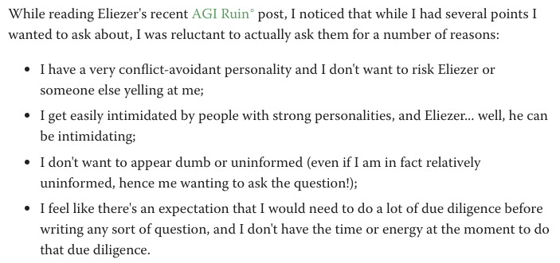

Recently I met a new coworker, a now-former professor who left academia. Like many, he seemed wounded by the experience. This is his first private-sector job.  

最近，我遇到了一位新同事，一位离开学术界的现任教授。和许多人一样，他似乎因这次经历而受伤。这是他在私营部门的第一份工作。

I have to give him respect: he left willingly. He had a plum position, and he was years away from tenure review. It’s hard to walk away from a place like that after a lifetime of striving. But he was unhappy, and he’d grown disenchanted with his research agenda, and didn’t enjoy the labor itself anymore, and it was degrading his ability to enjoy his private life; so he quit. Not everyone is brave enough to do that.  

我必须尊重他：他自愿离开。他的职位很不错，而且距离终身教职审查还有好几年的时间。经过一生的奋斗后，很难离开这样的地方。但他并不快乐，他对自己的研究议程不再抱有幻想，不再享受劳动本身，这降低了他享受私人生活的能力；所以他退出了。并不是每个人都有足够的勇气这样做。

When I was talking to him about onboarding and getting acquainted, I realized I was speaking to a more-accomplished version of my past self. There are certain pernicious behavioral patterns and outlooks that are instilled in a graduate student. Over the coming weeks I’ll do my best to shepherd my coworker into the private sector and help him overcome what’s been done to him; but today I had only a half hour, and was constrained by professional norms, and could only touch on the surface.  

当我和他谈论入职和结识时，我意识到我正在和过去的自己交谈，这个版本更加有成就。研究生中灌输了某些有害的行为模式和观点。在接下来的几周里，我将尽我所能引导我的同事进入私营部门，并帮助他克服所遭受的一切；但今天只有半个小时，而且受专业规范的限制，只能接触到一些皮毛。

However: I have endless time to write online.  

然而：我有无尽的时间在网上写作。

Recognizing that many of you may be in a similar position to my coworker—or worse, for those of you who are still locked into the system and might want some perspective from an apostate—I offer some thoughts about what unspoken norms typify academic environments, how they’re maladaptive in the private sector (and just about everywhere), and the ways in which one can more-successfully transition to a happy life as a corporate drone.  

认识到你们中的许多人可能与我的同事处于类似的境地——或者更糟糕的是，对于那些仍然被锁定在系统中并且可能想要从叛教者那里得到一些观点的人——我提供了一些关于学术环境中潜规则的一些想法，他们如何在私营部门（以及几乎所有地方）适应不良，以及如何更成功地过渡到作为企业无人机的幸福生活。

**Academia is Not Good for People  

学术界对人不利**

Earlier today I encountered a recent lesswrong post, screencapped here:  

今天早些时候，我遇到了一篇最近不太错误的帖子，屏幕截图如下：

I appreciate the poster’s honesty and self-awareness, and I think the points he enumerates here are a great distillation of what academia’s social environment does to people, or what gets exacerbated in people of a certain neurotype.  

我欣赏发帖人的诚实和自我意识，我认为他在这里列举的观点是对学术界社会环境对人们的影响的伟大提炼，或者是对某种神经类型的人的影响的伟大升华。

There is nothing morally wrong with these traits per se but I want to highlight that they are not just unpleasant to experience; they are inimical to functioning in a business environment and you would do well to divest yourself of them as quickly as you’re able when you make the leap.  

这些特征本身在道德上并没有什么问题，但我想强调的是，它们不仅令人不愉快，而且还令人不快。它们不利于在商业环境中发挥作用，当你迈出这一步时，你最好尽快摆脱它们。

I break my advice into four main points.  

我将我的建议分为四个要点。

**No One Thinks You Are Dumb  

没有人认为你很蠢**

Academia is curious in that performance, both relative and cardinal, is evaluated explicitly and sometimes publicly; you develop a reputation quickly, and making errors especially in a classroom or seminar setting can be humiliating. Academics for their part tend to lean into this by playing the “let’s see how quickly I can destroy this entire presentation” game. While this is probably effective at incentivizing academics to identify errors in their work, it also leaves them massively risk-averse and concerned with their audience’s perception of them.  

学术界好奇的是，无论是相对的还是主要的表现，都得到了明确的、有时是公开的评估。你很快就能赢得声誉，而犯错误，尤其是在课堂或研讨会上，可能会让人感到羞辱。学者们倾向于通过玩“让我们看看我能多快毁掉整个演示文稿”的游戏来解决这个问题。虽然这可能有效地激励学者发现他们工作中的错误，但也让他们极度厌恶风险并担心观众对他们的看法。

My experience in industry is that no one gives a shit. Write up an analysis on time; be straightforward about your claims; make the limitations of the analysis very clear. People might argue with the outcomes, but if they do it’s not because they think you’re an idiot: it’s typically because they see a specific problem with your reasoning, or because they would prefer the results might be different. Typically you’re the most-capable person in the room in the context of your job class, and your coworkers tend to respect this by default.  

我在行业的经验是没有人在乎。按时写出分析；直截了当地表达你的主张；使分析的局限性非常清楚。人们可能会对结果提出异议，但如果他们这样做，并不是因为他们认为你是个白痴：通常是因为他们发现你的推理存在特定问题，或者因为他们希望结果可能有所不同。通常，在你的工作类别中，你是房间里最有能力的人，你的同事往往会默认尊重这一点。

Apart from any remaining anxiety and fear around perceptions of your intelligence, which you should abandon as quickly as possible, the biggest failure mode here is wasting time on perfectionism.  

除了对你的智力认知留下的任何焦虑和恐惧之外，你应该尽快放弃这些，这里最大的失败模式是在完美主义上浪费时间。

In school it can make sense to spend huge amounts of time trying to craft an analysis into a perfect gem of a paper to preclude any possible criticism from yourself or from others. In industry, though, no skeptical journal editor will review your work. It’s going to be a bunch of PMs and engineers, who will take you at your word that the analysis is what you say it is. They may have critiques, and good ones, but they will tend to stem from domain knowledge rather than a deep familiarity with the statistical properties of an estimator. And getting a good critique from a coworker is fine—there’s no penalty for this if you haven’t shipped yet. Just go back and fix it in five minutes, and be glad you didn’t spend three days trying to anticipate the error.  

在学校里，花大量的时间试图将分析写成一篇完美的论文，以排除来自自己或他人的任何可能的批评是有意义的。但在工业界，持怀疑态度的期刊编辑不会评论你的工作。这将是一群产品经理和工程师，他们会相信你的话，分析结果就是你所说的那样。他们可能有批评，也可能有好的批评，但它们往往源于领域知识，而不是对估计器统计特性的深入熟悉。得到同事的好评是很好的——如果你还没有发货，就不会受到任何惩罚。只需返回并在五分钟内修复它，并庆幸您没有花三天时间来尝试预测错误。

I’m not suggesting you be sloppy or dishonest, but coming from academia it’s likely that you are biased toward risk aversion in a way that makes no sense in a business environment where you are more likely to be judged on the basis of your output than on your technical sophistication.  

我并不是建议你马虎或不诚实，但来自学术界的你很可能会倾向于规避风险，这在商业环境中是没有意义的，因为在商业环境中，人们更有可能根据你的产出来评判你。取决于你的技术成熟度。

**No One Cares That You Are Smart  

没有人在乎你是否聪明**

The flip side of the fact that everyone assumes by default that you’re capable is that no one cares that you’re smart, and you should not waste your time, or their time, trying to demonstrate that you are.  

事实上，每个人都默认你有能力，这一事实的另一面是，没有人关心你是否聪明，你不应该浪费你的时间或他们的时间来试图证明你是聪明的。

Major failure modes include:  

主要失效模式包括：

-   Writing for an academic audience, rather than plainly and directly for an audience of sharp non-experts;  
    
    为学术读者写作，而不是为敏锐的非专家读者简单直接地写作；
    
-   Using the most esoteric methods available to show that you’re familiar with the methodological subtleties of a given problem (rather than to get an acceptable answer to a salient question). Unless you’re presenting to specialists, no one cares whether you’re using Huber-White standard errors or bootstrapping; they just want an answer that can inform a decision.  
    
    使用最深奥的方法来表明您熟悉给定问题的方法论微妙之处（而不是为一个突出问题获得可接受的答案）。除非您向专家演示，否则没有人关心您使用的是 Huber-White 标准错误还是引导法；他们只是想要一个可以为决策提供依据的答案。
    

Once again, I’m emphasizing the importance of being honest with yourself about the ROI from pursuing any given degree of sophistication in your methods, and in conveying results to your audience in an appropriate language and timeline. You don’t need to signal brilliance; you need to generate good-enough results quickly.  

我再次强调，在追求任何特定程度的方法复杂性以及以适当的语言和时间表向受众传达结果时，对自己诚实地对待投资回报率的重要性。你不需要表现出才华横溢；您需要快速产生足够好的结果。

The good news is that this is easy. Academia is characterized by well-trodden problems, hashed over for decades, and negligible novel data for resolving them. Industry is by comparison a mass of green field areas of inquiry with large budgets, minimal bureaucracy, and ample data. No one is going to stop you from deploying some fancy-ass model if you can do it quickly and get interesting results, but nine times out of ten opportunity cost considerations should lead to you choosing to simply plotting some lines that directly answer a question. This is not “sophisticated” but it is “fast and efficient” and most importantly it “works.”  

好消息是这很容易。学术界的特点是，问题几十年来一直被人们所熟知，而解决这些问题的新数据却微乎其微。相比之下，工业界是一大片未开发的研究领域，拥有大量预算、最少的官僚机构和充足的数据。如果你能快速完成并获得有趣的结果，没有人会阻止你部署一些花哨的模型，但是十分之九的机会成本考虑应该导致你选择简单地绘制一些直接回答问题的线。这并不“复杂”，但它“快速高效”，最重要的是它“有效”。

**Just Talk To People 只与人交谈**

People in business are somewhat more extraverted than in academia, but there are more important reasons that you should feel good about just approaching them and talking to them.  

商界人士比学术界人士更加外向，但有更重要的原因让你在接近他们并与他们交谈时应该感觉良好。

-   It is literally their job to talk to you and answer your questions where it’s relevant to work. If they get mad at you for reaching out that’s on them.  
    
    从字面上看，他们的工作就是与您交谈并回答您与工作相关的问题。如果他们因为你伸出援手而对你生气，那是他们的责任。
    
-   It is also literally your job to talk to other people about work and if you’re not talking to people you’re missing out on essential information.  
    
    从字面上看，与其他人谈论工作也是你的工作，如果你不与人交谈，你就会错过重要的信息。
    
-   Asking people questions directly is often the fastest way to solve a problem. Your employer would rather you solve a problem by asking someone a basic question and getting an answer in five minutes than by spending two entire workdays trying to grind out the answer.  
    
    直接向人们提问通常是解决问题的最快方法。你的雇主宁愿你通过问某人一个基本问题并在五分钟内得到答案来解决问题，而不是花整整两个工作日试图找到答案。
    
-   Many systems are poorly documented and the only way to get information is by asking someone with direct knowledge of that system.  
    
    许多系统的文档记录很少，获取信息的唯一方法是询问直接了解该系统的人。
    

No one is going to think that you are dumb for asking a basic question and you need to get the answer anyway. Your performance is being evaluated but it’s on the basis of your output, and if you can improve your output by bothering a coworker for help you will be rewarded accordingly. In meetings, asking a basic question is often great because typically you are not the only person in attendance who lacks context.  

没有人会认为你问一个基本问题是愚蠢的，无论如何你都需要得到答案。你的表现正在被评估，但这是基于你的产出，如果你可以通过麻烦同事寻求帮助来提高你的产出，你将获得相应的奖励。在会议中，提出一个基本问题通常很好，因为通常您并不是唯一一个缺乏背景信息的与会者。

Some people in industry _do_ have strong personalities and they can be hard to deal with at first if you’re more retiring. The good news is that developing a strong personality is partly a matter of practice, and it can be turned on or off; and dealing with such personalities where your interests are hypothetically aligned is a good learning situation. Remember going into such conversations that you’re probably speaking from a position of authority in your job class, and it is _expected_ of you that you fulfill your role, even where that involves standing your ground when someone is trying to bowl you over; and further that you are _empowered_ to do so in most cases.

  

工业界的一些人确实个性很强，如果你比较退休，一开始他们可能会很难相处。好消息是，培养坚强的个性在一定程度上是需要练习的，而且它可以被开启或关闭。与那些假设你的兴趣一致的人物打交道是一个很好的学习情况。请记住，在进行此类对话时，您可能是在自己的工作类别中处于权威地位，并且人们期望您履行自己的职责，即使这需要在有人试图击败您时坚持自己的立场；此外，在大多数情况下您有权这样做。 1

If it helps, you can view encounters like this as exercises in interacting with a social obstacle in such a way as to realize an end, rather than a normal “human” interaction. You can also talk to your manager or coworkers about how to handle such interactions in advance.  

如果有帮助的话，你可以将这样的遭遇视为与社会障碍互动以实现目的的练习，而不是正常的“人”互动。您还可以提前与您的经理或同事讨论如何处理此类互动。

Finally, just communicate openly with your manager. A virtue in the workplace is fast feedback; they should be giving you a rundown of what they think you’ve done well or poorly in regular meetings, and how to improve on mistakes. If they don’t, make sure you ask for this feedback. If something is going wrong, communicate about that too. It’s very easy to come from an environment where you talk to your advisor perhaps every month or so and continue to hole up on a project, but this is terrible for staying engaged with your team.  

最后，与你的经理开诚布公地沟通。快速反馈是职场的一大美德；他们应该在例行会议上向你简要介绍他们认为你做得好或做得不好的地方，以及如何改进错误。如果他们不这样做，请务必询问此反馈。如果出现问题，也要进行沟通。在这样的环境中，你很容易会每个月左右与顾问交谈一次，然后继续埋头于一个项目，但这对于与团队保持联系来说是很糟糕的。

**Just Do Things (or Don’t)  

只做某事（或不做某事）**

School tends to train people to inhabit a state where they passively wait for assignments. That _can_ happen in industry but the norm is for a group of people to identify a problem or opportunity and move quickly to solve or take advantage of it. Over time, you’re not going to do well if you don’t adapt to this new environment and become proactive about seeking things to change and charging ahead on them.  

学校倾向于训练人们处于一种被动等待作业的状态。这种情况在行业中可能会发生，但通常情况是一群人发现问题或机会，并迅速采取行动解决或利用它。随着时间的推移，如果你不适应这个新环境，不主动寻求改变并勇往直前，你就不会做得很好。

I’m not suggesting you shouldn’t clear major projects with your manager, and for larger initiatives you’ll have to convince people to pitch in with you. But, by and large, the onus is on you to use the local knowledge you develop to seize opportunities as they arrive and make progress on improving things rather than waiting for a task to be assigned to you.  

我并不是建议你不应该与你的经理一起清理重大项目，对于更大的计划，你必须说服人们与你一起参与。但是，总的来说，你有责任利用你所掌握的当地知识来抓住机会，并在改进方面取得进展，而不是等待分配给你的任务。

A corollary is that you have control over what you’re working on and more often than not you can decide to stop doing it if a better use of your time exists. Some deadlines are hard, but it’s often the case that a given project becomes stale and _should_ be deferred or even abandoned to take advantage of a higher ROI option. Prioritizing work in this way is a major skill in itself and the best way to speed its development is, as usual, clear communication with your manager or coworkers.  

一个推论是，你可以控制自己正在做的事情，而且如果可以更好地利用你的时间，你通常可以决定停止做这件事。有些截止日期很困难，但通常情况下，给定的项目会变得过时，应该推迟甚至放弃，以利用更高的投资回报率选项。以这种方式确定工作的优先顺序本身就是一项主要技能，而加速其发展的最佳方法是像往常一样，与您的经理或同事进行清晰的沟通。

**Conclusion: It’s Not Just Industry  

结论：这不仅仅是行业**

Having run through some core areas in which academia is poor preparation for life generally, I want to make a closing point that the scholastic foibles I’ve discussed are also culturally-bound antipatterns in daily life. In the spirit of industry-optimized plain communication, I leave you with bullets:  

在回顾了学术界普遍对生活准备不足的一些核心领域后，我想最后指出，我所讨论的学术缺陷也是日常生活中受文化束缚的反模式。本着行业优化的简单沟通的精神，我给您留下要点：

-   You can choose to identify as things other than “smart” and you will probably be a better person for it as well as functionally smarter. Find some other value to signal.  
    
    你可以选择将自己视为“聪明”以外的事物，你可能会因此成为一个更好的人，并且在功能上变得更聪明。寻找其他一些值来发出信号。
    
-   People are not your professor or advisor. Just talk to them. Maybe they yell at you for impertinence but so what? They probably don’t have any power over you and the alternative is spending your entire life a wallflower.  
    
    人们不是你的教授或顾问。只要和他们谈谈。也许他们会因为你的无礼而大喊大叫，但那又怎样呢？他们可能对你没有任何权力，否则你就只能一辈子做壁花。
    
-   You don’t need to ask permission to go to the bathroom and you can seize opportunities of your own volition rather than waiting for them to fall into your lap like an essay due a week from Friday.  
    
    你上厕所不需要征得同意，你可以主动抓住机会，而不是像周五一周后交的论文一样等待它们落到你的腿上。
    
-   Is some project or effort no longer worthwhile? Are you realistically never going to finish it and just experiencing anxiety about your ongoing commitment but you _said_ you were gonna do it so you have to?  
    
    某些项目或努力是否不再值得？你是否真的永远不会完成它，只是对你持续的承诺感到焦虑，但你说你会这样做，所以你必须这样做？
    

### Support eigenrobot,s Blog  

支持eigenrobot的博客

this is a Blog writtten by eigenrobot  

这是 eigenrobot 写的博客
