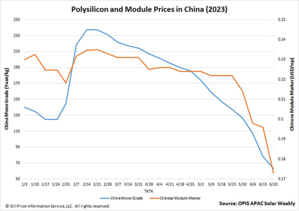

The Chinese Module Marker (CMM), OPIS’ benchmark assessment for modules from China, dived to $0.173 per W, falling for a fourth week running to its lowest value ever according to OPIS data. In the aftermath of Intersolar Europe, the market must reckon with clear signals that the region is oversupplied with modules, as well as how China polysilicon prices upstream are very close to their floor.  

OPIS 对中国组件的基准评估——中国组件市场指数 (CMM) 跌至每瓦 0.173 美元，连续第四周跌至 OPIS 数据显示的历史最低值。在Intersolar Europe之后，市场必须考虑到该地区组件供应过剩的明确信号，以及中国上游多晶硅价格非常接近底线的情况。

The 11.73% week-on-week plunge is also record-breaking in being CMM’s largest percentage drop ever.  

11.73%的周环比跌幅也创纪录，是 CMM 有史以来最大的百分比跌幅。

It comes as OPIS contacts, during and since Intersolar, have almost unanimously highlighted that prices are falling fast and hard. The majority saw prices in the $0.170-0.175/W range, with numbers as low as $0.150/W heard. Some did not share prices as they assessed the degree of the drop.  

与此同时，在 Intersolar 展会期间及之后，OPIS 联系人几乎一致强调价格正在快速而剧烈地下跌。大多数人认为价格在 0.170-0.175 美元/瓦的范围内，也有听说低至 0.150 美元/瓦的价格。一些人在评估下跌程度时没有分享价格。

With a similar unanimity, market players also lamented the overstocked state of Europe’s module inventories, which face falling values and which curtail further shipments. Europe installed a record 46.1 GW of solar power in 2022, according to a SolarPower Europe report. But around 85 GW of modules were shipped there last year, with the remainder ending up in warehouses owned by Chinese companies across Europe, according to a veteran market observer.  

市场参与者也一致对欧洲组件库存过剩的状况表示遗憾，这些库存面临价格下跌并限制了进一步的出货量。根据 SolarPower Europe 报告，2022 年欧洲太阳能装机容量达到创纪录的 46.1 吉瓦。但据一位资深市场观察人士称，去年约有 85 吉瓦的组件运往欧洲，其余的最终运往欧洲各地中国公司拥有的仓库。

Given these modules represent 2022’s much-higher-than-present prices, it is better to get them sold now, before prices fall further and companies risk losing even more, the veteran added.  

这位资深人士补充说，鉴于这些模块代表 2022 年的价格远高于目前，最好现在就出售它们，以免价格进一步下跌，公司可能面临更大的损失。

A continent away from Europe, China polysilicon prices have plummeted to CNY63.5 ($8.84)/kg, on the threshold of the CNY60/kg figure OPIS contacts generally consider the material’s cost figure. It is a “common consensus” that this market now faces overcapacity, said one source, who added that China’s tier-1 manufacturers alone have more than 100,000 MT of polysilicon stockpiled.  

远离欧洲的大陆，中国多晶硅价格已暴跌至 63.5 元人民币（8.84 美元）/公斤，在 60 元人民币/公斤的门槛上，OPIS 联系人通常会考虑材料的成本数字。一位消息人士称，该市场目前面临产能过剩已是“普遍共识”，他补充说，仅中国一级制造商的多晶硅库存就超过10万吨。

Looking ahead and in light of these bearish factors, module prices are expected to keep sliding, with one source expecting them to stabilize in the next quarter after the polysilicon and wafer segments have hit their cash cost.  

展望未来，鉴于这些利空因素，组件价格预计将继续下滑，一位消息人士预计，在多晶硅和硅片部分触及现金成本后，组件价格将在下一季度企稳。

_OPIS, a Dow Jones company, provides energy prices, news, data, and analysis on gasoline, diesel, jet fuel, LPG/NGL, coal, metals, and chemicals, as well as renewable fuels and environmental commodities. It acquired pricing data assets from Singapore Solar Exchange in 2022 and now publishes the [OPIS APAC Solar Weekly Report](https://www.opisnet.com/product/pricing/spot/apac-solar-weekly-report-pv-magazine/).  

OPIS 是道琼斯旗下公司，提供汽油、柴油、喷气燃料、液化石油气/液化天然气、煤炭、金属和化学品以及可再生燃料和环境商品的能源价格、新闻、数据和分析。它于 2022 年从新加坡太阳能交易所收购了定价数据资产，现在发布 OPIS 亚太太阳能周报。_

The views and opinions expressed in this article are the author’s own, and do not necessarily reflect those held by **pv magazine**.  

本文中表达的观点和意见是作者自己的，并不一定反映《光伏》杂志的立场。

This content is protected by copyright and may not be reused. If you want to cooperate with us and would like to reuse some of our content, please contact: [editors@pv-magazine.com](mailto:editors@pv-magazine.com).  

该内容受版权保护，不得重复使用。如果您想与我们合作并希望重复使用我们的一些内容，请联系：editors@pv-magazine.com。
