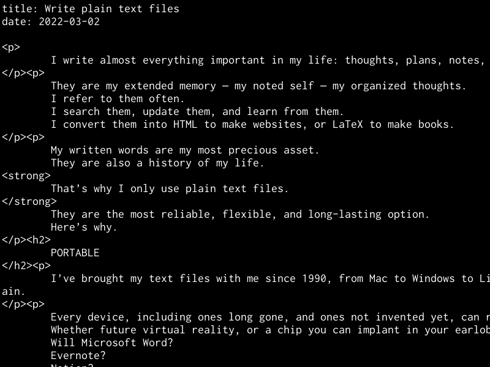

2022-03-02

I write almost everything important in my life: thoughts, plans, notes, diaries, correspondence, code, articles, and entire books.  

我写下生活中几乎所有重要的东西：想法、计划、笔记、日记、信件、代码、文章和整本书。

They are my extended memory — my noted self — my organized thoughts. I refer to them often. I search them, update them, and learn from them. I convert them into HTML to make websites, or LaTeX to make books.  

它们是我的扩展记忆——我注意到的自我——我有条理的思想。我经常提到他们。我搜索它们、更新它们并向它们学习。我将它们转换成 HTML 来制作网站，或者将它们转换成 LaTeX 来制作书籍。

My written words are my most precious asset. They are also a history of my life. **That’s why I only use plain text files.** They are the most reliable, flexible, and long-lasting option. Here’s why.  

我的文字是我最宝贵的资产。它们也是我人生的一段历史。这就是为什么我只使用纯文本文件。它们是最可靠、最灵活、最持久的选择。原因如下。

## PORTABLE   便携的

I’ve brought my text files with me since 1990, from Mac to Windows to Linux to BSD, from PCs to laptops to tablets to Android to iOS to a tiny device the size of my thumb, and back again.  

自 1990 年以来，我一直带着文本文件，从 Mac 到 Windows、Linux、BSD，从 PC 到笔记本电脑、平板电脑、Android、iOS，再到拇指大小的微型设备，然后再回来。

**Every device, including ones long gone, and ones not invented yet, can read and edit plain text.** Whether future virtual reality, or a chip you can implant in your earlobe, plain text will be there. Will Microsoft Word? Evernote? Notion? Maybe. Maybe not.  

每台设备，包括早已消失的设备和尚未发明的设备，都可以读取和编辑纯文本。无论是未来的虚拟现实，还是可以植入耳垂的芯片，纯文本都将存在。微软Word会吗？印象笔记？概念？或许。也许不会。

But plain text? Always. Everywhere.  

但纯文本？总是。到处。

## UN-COMMERCIAL  商业广告

Every few years a new company says you should use their special format. You have to pay them a monthly fee to use it — or keep all of your documents in their care. They offer some convenience or features, but at the cost of flexibility, portability, and independence.  

每隔几年就会有一家新公司说你应该使用他们的特殊格式。您必须每月向他们支付费用才能使用它，或者将您的所有文件交给他们保管。它们提供了一些便利或功能，但代价是灵活性、可移植性和独立性。

When you store your writing in one company’s unique format, then you need that program to access it. Then the economy takes a turn, they go out of business, and your work is trapped in an unusable format.  

当您以一家公司的独特格式存储您的写作时，您需要该程序来访问它。然后经济发生转变，他们倒闭，你的工作就陷入了无法使用的格式。

**You will outlive these companies.** Your writing should outlive you. Depending on companies is not an option.  

你将比这些公司活得更久。你的写作应该比你更长寿。依赖公司不是一个选择。

Plain text is un-commercial. It removes you from the world of subscriptions and hype. There will always be plenty of free, non-commercial software in the public domain for reading and editing text files.  

纯文本是非商业性的。它将您从订阅和炒作的世界中删除。公共领域总会有大量免费的非商业软件用于读取和编辑文本文件。

## OFFLINE   离线

There are places and times when you can’t get online. Don’t depend on any tool that needs an internet connection.  

有些地方和时间您无法上网。不要依赖任何需要互联网连接的工具。

**There are great benefits to being intentionally offline and unreachable, to focus.** It’s a super productivity boost. You need to be able to write, and have access to all your writing, during these times.  

故意离线和无法联系有很大的好处，可以集中注意力。这是生产力的超级提升。在这段时间里，你需要能够写作，并能够访问你所有的作品。

## NO DEPENDENCIES  无依赖性

If you rely on Word, Evernote or Notion, for example, then you can’t work unless you have Word, Evernote, or Notion. **You are helpless without them.** You are dependent.  

例如，如果您依赖 Word、Evernote 或 Notion，那么除非您有 Word、Evernote 或 Notion，否则您无法工作。没有他们你会很无助。你是依赖的。

People tell me about more tools I could use in addition to my text files. But I don’t need or want anything else. **Plain text files and a basic text editor are enough. This is everything you need for great thinking and writing.** (A paper notebook and pencil are enough, too.)  

人们告诉我除了文本文件之外还可以使用更多工具。但我不需要或想要任何其他东西。纯文本文件和基本的文本编辑器就足够了。这是出色思考和写作所需的一切。 （纸质笔记本和铅笔就足够了。）

If you only use plain text, you can work on any device, forever. The less you depend on, the better. Peace and focus come when you stop looking for more.  

如果您仅使用纯文本，则可以永远在任何设备上工作。你依赖的越少越好。当你不再追求更多时，平静和专注就会到来。

## EASIEST TO CONVERT  

最容易转换

Plain text can be converted into anything else.  

纯文本可以转换成其他任何内容。

HTML, Markdown, JSON, LaTeX, and many other standard formats, are just plain text. I’ve written four books and four hundred blog posts in plain text.  

HTML、Markdown、JSON、LaTeX 和许多其他标准格式只是纯文本。我已经用纯文本写了四本书和四百篇博客文章。

You can make your own personal formats in your plain text files. Maybe in each diary entry, the first two lines are like:  

您可以在纯文本文件中创建自己的个人格式。也许在每一篇日记中，前两行都是这样的：

```
date: 2022-02-28
tags: where-to-live, kids, dog, anxious


```

Then it’s easy to use any little scripting language like Ruby, Python, or JavaScript to grab the date and tags, and use them for categorizing, sorting, renaming, archiving, or exporting.  

然后，可以轻松使用任何小型脚本语言（如 Ruby、Python 或 JavaScript）来获取日期和标签，并使用它们进行分类、排序、重命名、存档或导出。

Or if you don’t want to do it yourself, then it’s easy to find someone who can. Anyone who’s been programming for more than a week should be able to do it easily.  

或者，如果您不想自己做，那么很容易找到可以做的人。任何已经编程超过一周的人都应该能够轻松完成。

## NEED HIERARCHY?  需要层次结构吗？

Use directories — also known as folders. These are also good for keeping your text together with other files like images and audio.  

使用目录 - 也称为文件夹。这些也有助于将文本与图像和音频等其他文件保存在一起。

```
Documents/
Documents/Diary/
Documents/Diary/2022/
Documents/Diary/2022/2022-02-28.txt
Documents/Thoughts/
Documents/Thoughts/WhereToLive/
Documents/Thoughts/WhereToLive/2019-06-30.txt
Documents/Thoughts/WhereToLive/2020-01-18.txt
Documents/Ideas/
Documents/Ideas/MusicalChairs.txt
Documents/Ideas/NewHouse/
Documents/Ideas/NewHouse/Design/
Documents/Ideas/NewHouse/Design/entryway.jpg
Documents/Ideas/NewHouse/Design/roof.jpg
Documents/Ideas/NewHouse/Architect/
Documents/Ideas/NewHouse/Architect/JM_Lim.txt
Documents/Ideas/NewHouse/Architect/TPS_Inc.txt


```

## NEED VISUALS OR GRAPHICS?  

需要视觉效果或图形吗？

Need visual mind-mapping with circles and lines? Maybe you do. **But maybe you don’t.** Maybe it’s just another distraction, focusing on the tools instead of your thinking.  

需要用圆圈和线条进行视觉思维导图吗？也许你会。但也许你不知道。也许这只是另一种干扰，专注于工具而不是你的想法。

I love that plain text files have no formatting to tinker with. A tab key, SHIFT KEY, and vertical line breaks can go a long way, keeping you writing instead of formatting.  

我喜欢纯文本文件没有可修改的格式。 Tab 键、SHIFT 键和垂直换行符可以发挥很大作用，让您保持书写而不是格式化。

If you really need graphics, do your drawing using something else. Digital drawing into SVG files. Paper drawing, scanned into JPGs.  

如果您确实需要图形，请使用其他工具进行绘图。将数字绘图转换为 SVG 文件。纸质绘图，扫描成 JPG。

Formats that aren’t owned by any company. Formats that will outlast you.  

不属于任何公司的格式。比您更长久的格式。

Keep your graphics files alongside your text files. But keep your text as plain text.  

将图形文件与文本文件放在一起。但请将您的文本保留为纯文本。

## CONCLUSION  结论

Reliable, flexible, portable, independent, and long-lasting. Plain text files will be readable by future generations, hundreds of years from now.  

可靠、灵活、便携、独立、持久。数百年后的后代将可以读取纯文本文件。

I especially enjoy the tranquility of their offline, non-commercial nature. They’re quiet. They’re focused. (As I aim to be.)  

我特别喜欢它们线下、非商业性质的宁静。他们很安静。他们很专注。 （正如我的目标。）


