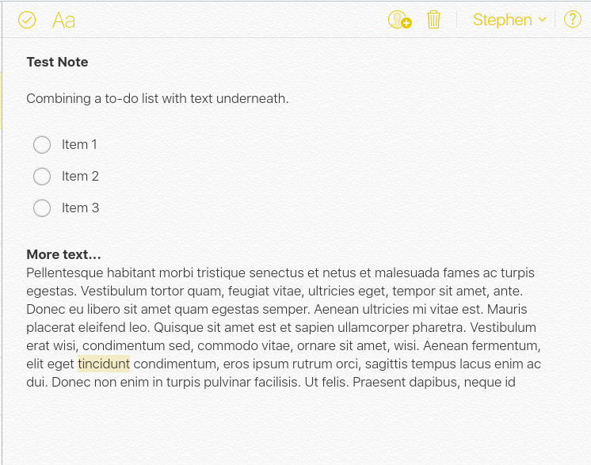

iOS Notes iOS 笔记  

vs  

Google Keep 古吉堡

Back in 2013, shortly after making the switch from iOS to [Android](https://theartdirectedjournal.github.io/android), I began using [Google Keep](https://www.google.com/keep/) as my note taking app of choice. Keep is a relatively simple app, and not only does it have the ability to sync between all of my devices, it is also free. Additionally, Google has added some useful features to Keep over time, including but not limited to voice recording, drawing, and importing photos. I briefly switched over to Microsoft's OneNote for a short time when I had a Windows phone, but once I switched back to Android thereafter, I migrated all my notes back into Google Keep. In fact, when I [moved back to iOS in July of last year](https://theartdirectedjournal.github.io/iphoneSE), I deleted Apple's default iOS Notes app and continued to use Google Keep.  

早在 2013 年，从 iOS 切换到 Android 后不久，我就开始使用 Google Keep 作为我选择的笔记应用程序。 Keep 是一个相对简单的应用程序，它不仅能够在我的所有设备之间同步，而且还是免费的。此外，随着时间的推移，Google 还为 Keep 添加了一些有用的功能，包括但不限于录音、绘图和导入照片。当我拥有 Windows 手机时，我曾短暂切换到 Microsoft 的 OneNote，但此后切换回 Android 后，我将所有笔记迁移回 Google Keep。事实上，当我去年 7 月回到 iOS 时，我删除了 Apple 默认的 iOS Notes 应用程序，并继续使用 Google Keep。

However, I recently came across a few articles about Twitter founder Jack Dorsey and how he [uses only an iPhone](https://www.cnbc.com/2018/10/18/why-twitter-ceo-jack-dorsey-works-on-an-iphone-not-a-laptop.html) to run both Twitter and Square. His extensive use of the native notes application on his phone, iOS Notes, is one of the things that empowers him to eliminate a laptop or a tablet from his workflow. This inspired me to re-examine iOS Notes. If a founder and CEO of two giant corporations can run things only using his phone and [using the stock Apple Notes app](https://mobile.twitter.com/jack/status/1012428138326851585) on that phone, it must mean that Apple's native notes app has made some vast improvements since its skeuomorphic days in earlier versions of iOS. Could it be that iOS Notes is better than Google Keep? I just had to find out.  

不过，我最近看到了几篇关于 Twitter 创始人 Jack Dorsey 的文章，以及他如何仅使用 iPhone 来运行 Twitter 和 Square。他广泛使用手机上的原生笔记应用程序 iOS Notes，这是他能够从工作流程中消除笔记本电脑或平板电脑的原因之一。这激发了我重新审视 iOS Notes。如果两家大公司的创始人兼首席执行官只能使用他的手机和该手机上的苹果笔记应用程序来运行事务，那么这一定意味着苹果的原生笔记应用程序自早期版本的 iOS 中的拟物化时代以来已经取得了一些巨大的改进。难道 iOS Notes 比 Google Keep 更好？我只是想找出答案。

Design...

Both applications are easy enough to use and provide a low barrier of entry to actually getting notes on the page. Both applications are well designed in that regard, with very similar color schemes. While both having icons with a significant amount of yellow in them, iOS Notes actually uses more yellow within the app itself. In this way, Keep is slightly easier on the eyes. It is also my opinion that Keep has better typography. However, there is a subtle paper like background in Notes that I really like. It's skeumorphic, but not overtly skeumorphic. Design is highly subjective though.  

这两个应用程序都非常易于使用，并且在页面上实际获取笔记的进入门槛较低。这两个应用程序在这方面都设计得很好，具有非常相似的配色方案。虽然两者的图标都含有大量的黄色，但 iOS Notes 实际上在应用程序本身中使用了更多的黄色。这样一来，Keep 就稍微养眼一些了。我也认为 Keep 的排版更好。然而，我真的很喜欢Notes中类似纸张的微妙背景。它是拟物化的，但不是明显的拟物化。但设计是非常主观的。

Features...

Keep and iOS Notes (just referred to as Notes from here on out) have a very similar feature set. Both are kind of “bare bones”, if you will, but that is exactly what I look for in a note taking application. In terms of what I feel are “must have” features, the two applications do share quite a few. Notes has built in spell check. Keep has spell check as well. Both are backed by big corporations and sync to their respective clouds. I know this might sound strange, but if I am going to be syncing my notes to the cloud, I want to ensure that cloud is robust and will be there for some time to come. I know that Google has been known to kill popular apps, and I know that Apple could change direction with Notes and iCloud at any point they so choose, but I would rather use something like Notes or Keep than a smaller app like Simplenote or Bear. That said, one of the key features that sets Notes apart is that individual notes taken in Notes can be password protected. On the iPhone, password protected notes can be unlocked with Touch ID / Face ID. In the browser, notes can be unlocked by providing the password. Keep does not appear to offer the ability to password protect a note.  

Keep 和 iOS Notes（以下简称“Notes”）具有非常相似的功能集。如果你愿意的话，两者都是“简单的骨头”，但这正是我在笔记应用程序中寻找的东西。就我认为“必须具备”的功能而言，这两个应用程序确实有很多共同点。 Notes 内置了拼写检查功能。 Keep 还具有拼写检查功能。两者都得到大公司的支持并同步到各自的云。我知道这可能听起来很奇怪，但如果我要将我的笔记同步到云端，我想确保云是强大的并且会在未来一段时间内存在。我知道谷歌会扼杀流行的应用程序，而且我知道苹果可以在他们选择的任何时候改变Notes和iCloud的方向，但我宁愿使用Notes或Keep之类的东西，而不是像Simplenote或Bear这样的较小的应用程序。也就是说，Notes 与众不同的关键功能之一是 Notes 中记录的各个笔记可以受到密码保护。在 iPhone 上，可以使用 Touch ID / Face ID 解锁受密码保护的笔记。在浏览器中，可以通过提供密码来解锁笔记。 Keep 似乎不提供密码保护笔记的功能。

Google Keep has the ability to attach a reminder directly to any note. This happens to be an extremely useful feature, and for the longest time, this appeared to be the one “gotta have” feature that would keep me using Keep. However, I recently found that one can use Siri to set a reminder for a note created in Notes. The first step is to create a note. Next, with the newly created note open, one can say, “Hey Siri. Remind me about this at 2pm today”, for example. Siri will then create a corresponding reminder in the Reminders app in iOS. One can also enable typing to Siri in the iPhone’s accessibility settings. If that is enabled, instead of verbally calling for Siri, one can simply hold down the home button (I use an iPhone SE) and type the reminder command into Siri. In the Reminders app on the phone, the reminder is actually linked to the note in Notes. Taping on the Notes icon within the remider will pop open the Notes app and the corresponding note. If using Notes.app on the Mac, I would assume that the process of setting a reminder using Siri would be similar. As I am currently using Notes in iCloud.com via the browser, the ability to attach a reminder to a note does not exist. Accessing Keep via the Chrome app or via the web, one can easily attach a reminder to a note by simply tapping/clicking on the reminder icon. As such, the reminder functionality of Keep is slightly more comprehensive.  

Google Keep 能够将提醒直接附加到任何笔记上。这恰好是一个非常有用的功能，并且在很长一段时间里，这似乎是让我继续使用 Keep 的“必须拥有”的功能。不过，我最近发现可以使用 Siri 为 Notes 中创建的便笺设置提醒。第一步是创建注释。接下来，打开新创建的笔记，人们可以说：“嘿 Siri。例如，今天下午 2 点提醒我这一点”。 Siri 随后会在 iOS 的“提醒”应用中创建相应的提醒。人们还可以在 iPhone 的辅助功能设置中启用 Siri 打字功能。如果启用该功能，则无需口头呼叫 Siri，只需按住主页按钮（我使用 iPhone SE）并向 Siri 中输入提醒命令即可。在手机上的“提醒”应用中，提醒实际上链接到“备忘录”中的便笺。点击提醒中的“笔记”图标将弹出“笔记”应用程序和相应的笔记。如果在 Mac 上使用 Notes.app，我会假设使用 Siri 设置提醒的过程会类似。由于我目前通过浏览器在 iCloud.com 中使用 Notes，因此不存在将提醒附加到便笺的功能。通过 Chrome 应用程序或网络访问 Keep，只需点击/单击提醒图标即可轻松将提醒附加到笔记中。因此，Keep的提醒功能稍微全面一些。

With Notes, it appears that you can have more than one type of note in a note. For example, a single note can combine a to-do list with checkboxes and paragraphs of text underneath. I have not been able to get Keep to mimic this. Notes also has the ability to make text bold, italicize text, as well as underline text. One can create headings and sub-headings. One can add a title to a note, or not. If a title to a note is added, that is what shows up in the main list of notes within the app. If a title is not added to a note, the first few lines show up as the title in the main list. Individual notes in Keep are limited to simple plain text. A title is optional, but there is a dedicated field for the title.  

使用注释，您似乎可以在一个注释中包含多种类型的注释。例如，单个注释可以将待办事项列表与下面的复选框和文本段落结合起来。我无法让 Keep 模仿这一点。 Notes 还能够将文本设为粗体、斜体以及下划线文本。人们可以创建标题和副标题。人们可以为笔记添加标题，也可以不添加标题。如果添加了笔记标题，该标题就会显示在应用程序内笔记的主列表中。如果未将标题添加到注释中，则前几行将显示为主列表中的标题。 Keep 中的单个笔记仅限于简单的纯文本。标题是可选的，但有一个专门的标题字段。

Both applications have the ability to upload photos, and as previously stated, both applications provide one the ability to draw within notes. However, one feature that really sets Notes apart from Keep is the ability to scan a document using the phone's camera and export that scanned document as a .pdf. This feature has proven itself invaluable over the course of the last few months.  

这两个应用程序都具有上传照片的功能，并且如前所述，这两个应用程序都提供了在笔记中绘图的功能。然而，真正将 Notes 与 Keep 区别开来的一项功能是能够使用手机的摄像头扫描文档并将扫描的文档导出为 .pdf。在过去的几个月里，这一功能已经证明了自己的价值。

Ease of Access... 四通八达的交通网络...

Keep is available for iOS through the App Store and preinstalled on most Android devices. However, Notes, while preinstalled on iOS, is not available for Android (at least to my knowledge) through Google Play or side load. On the laptop / desktop side of things, Google Keep has a stand-alone Chrome app which works on Windows, Mac or Linux. One can also access their notes stored in Keep via any web browser. The browser based application syncs well and is fast and fluid. There is even a link to quickly view Keep from within GMail on the web. iCloud notes are accessible from within the native Notes.app on a Mac only, but iCloud notes are also accessible through any browser on Windows, Mac or Linux. I have found, at least on Ubuntu 19.04, that iCloud is faster in Chrome than it is in Firefox. In my opinion, it safe to say that Keep is the slightly more widely available application, but an iOS user who is not also a Mac user would be just fine in the web app, provided they used Google Chrome. I would assume that Safari also perform well, but I have not tested that since I no longer use a Mac. The Epiphany browser (native Gnome browser based on Webkit) works terribly for what it is worth. I have not tested any of this in Microsoft Windows.  

Keep 可通过 App Store 适用于 iOS，并预装在大多数 Android 设备上。然而，Notes 虽然预装在 iOS 上，但无法通过 Google Play 或旁加载用于 Android（至少据我所知）。在笔记本电脑/台式机方面，Google Keep 有一个独立的 Chrome 应用程序，可以在 Windows、Mac 或 Linux 上运行。人们还可以通过任何网络浏览器访问存储在 Keep 中的笔记。基于浏览器的应用程序同步良好，快速且流畅。甚至还有一个可以从网络上的 GMail 中快速查看 Keep 的链接。 iCloud 笔记只能从 Mac 上的本机 Notes.app 中访问，但 iCloud 笔记也可以通过 Windows、Mac 或 Linux 上的任何浏览器访问。我发现，至少在 Ubuntu 19.04 上，iCloud 在 Chrome 中比在 Firefox 中更快。在我看来，可以肯定地说，Keep 是应用范围稍广的应用程序，但如果 iOS 用户不是 Mac 用户，那么只要他们使用 Google Chrome，就可以使用该网络应用程序。我认为 Safari 也表现良好，但我没有测试过，因为我不再使用 Mac。 Epiphany 浏览器（基于 Webkit 的原生 Gnome 浏览器）的性能非常出色。我还没有在 Microsoft Windows 中测试过这些。

Keep is also available as an app on Apple Watch, but only to view notes one has already created. One cannot create or edit notes directly on the watch. There is one exception. Items on to-do lists that were previously created in Keep, either via the mobile app or on the web, can be marked as complete on the Apple Watch. Unfortunately, at this time Apple does not offer Notes as an appliction on Apple Watch, and there is no way to take a note directly with Siri on Apple Watch. However, on the actual iPhone, Siri is able to take notes and send them to the Notes app. Unfortunately, Siri is unable to generate a note in Keep, nor is Keep able to take voice notes/dictate. One can create an audio note (an actual audio file) however.  

Keep 也可以作为 Apple Watch 上的应用程序使用，但只能查看已经创建的笔记。人们无法直接在手表上创建或编辑笔记。有一个例外。之前在 Keep 中通过移动应用程序或网络创建的待办事项列表中的项目可以在 Apple Watch 上标记为已完成。不幸的是，目前苹果并没有在Apple Watch上提供Notes应用程序，并且无法直接在Apple Watch上使用Siri做笔记。然而，在实际的 iPhone 上，Siri 能够记笔记并将其发送到 Notes 应用程序。不幸的是，Siri 无法在 Keep 中生成笔记，Keep 也无法进行语音笔记/听写。然而，人们可以创建一个音频笔记（一个实际的音频文件）。

As a quick aside, from a mobile perspective, at least on my iPhone SE, Notes launches slightly faster on the iPhone than does Keep. In fact, I am finding this to be true with many of Apple's native apps. For example, iOS's native mail app launches much faster than does Outlook or GMail. Outlook is actually very slow to launch and render anything on my SE. GMail for iOS only launches slightly slower than does Apple's native mail app. In fact, I actually quite like the GMail app for iOS. It is fast, fluid and allows for push emails where the native iOS mail app can only fetch mail from GMail accounts. As another example, Safari launches much faster and performs much better than does Chrome or Firefox on iOS. This is due to Apple's imposed limitations on the two non-native browsers, as Apple will not allow the true rendering engines of these browsers to be used on iOS, instead making the developers use a sub-par version of Webkit. But I digress. This is actually something that I should elaborate on in a future piece.  

顺便说一句，从移动的角度来看，至少在我的 iPhone SE 上，Notes 在 iPhone 上的启动速度比 Keep 稍快一些。事实上，我发现苹果的许多原生应用程序都是如此。例如，iOS 的本机邮件应用程序的启动速度比 Outlook 或 GMail 快得多。实际上，Outlook 在我的 SE 上启动和渲染任何内容都非常慢。 iOS 版 GMail 的启动速度仅比 Apple 的本机邮件应用程序稍慢。事实上，我非常喜欢 iOS 版的 GMail 应用程序。它快速、流畅，并且允许推送电子邮件，而本机 iOS 邮件应用程序只能从 GMail 帐户获取邮件。另一个例子是，Safari 的启动速度比 iOS 上的 Chrome 或 Firefox 快得多，而且性能也好得多。这是由于苹果对这两种非原生浏览器施加了限制，苹果不允许这些浏览器的真正渲染引擎在 iOS 上使用，而是让开发者使用低于标准的 Webkit 版本。但我离题了。这实际上是我应该在以后的文章中详细阐述的内容。

To Sum It All Up — How I Use These Apps...  

总而言之——我如何使用这些应用程序......

While design is certainly subjective, these apps provide roughly the same feature set and have an easy barrier of entry to getting notes on the page. I have both on my phone at this time and use them both a good bit. Notes actually lives in the dock on my phone, as I use it frequently for things that I need to capture quickly. Keep lives in the Productivity folder on my second screen. That said, since I don't use a Mac, I put things into Keep that I need to be able to easily access cross platform. While I can access notes captured in iOS Notes through iCloud in the browser, it is not the ideal thing for me, especially since I have two-factor authentication turned on for my iCloud account.  

虽然设计肯定是主观的，但这些应用程序提供了大致相同的功能集，并且在页面上获取注释很容易进入。我的手机上现在都有这两款产品，并且都经常使用它们。笔记实际上位于我手机上的扩展坞中，因为我经常使用它来记录需要快速捕获的内容。将生活保留在我的第二个屏幕上的“生产力”文件夹中。也就是说，由于我不使用 Mac，因此我将需要能够轻松访问跨平台的内容放入 Keep 中。虽然我可以通过浏览器中的 iCloud 访问 iOS Notes 中捕获的笔记，但这对我来说并不是理想的选择，特别是因为我为 iCloud 帐户启用了双因素身份验证。

[Table of Contents 目录](http://theartdirectedjournal.github.io/)
